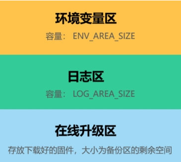
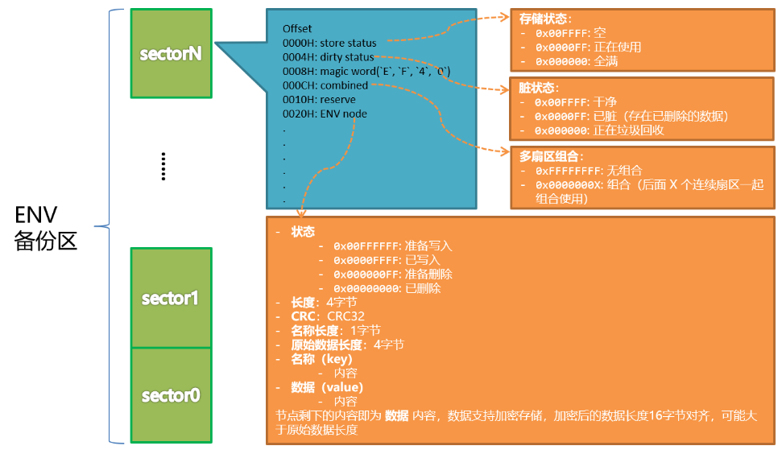

# 基本配置

`ef_cfg.h`设置 easyflash 的基本参数, 比如:

```c
/* the minimum size of flash erasure */
#define EF_ERASE_MIN_SIZE                           4096
/* backup area start address */
#define EF_START_ADDR     (g_ef_start_addr)
/* ENV area size. It's at least one empty sector for GC. So it's definition must more then or equal 2 flash sector size. */
#define ENV_AREA_SIZE     (2 * EF_ERASE_MIN_SIZE)
```


在配置时需要注意以下几点：

1. 所有的区域必须按照 EF_ERASE_MIN_SIZE 对齐；
1. 环境变量分区大少至少为两倍以上 EF_ERASE_MIN_SIZE；
1. 从 V4.0 开始 ENV 的模式命名为 NG 模式，V4.0 之前的称之为 LEGACY 遗留模式；
   1. 遗留模式已经被废弃，不再建议继续使用；
   1. 如果需要继续使用遗留模式，请 EasyFlash 的 V3.X 版本。

# sector 结构



对应下面结构体:

```c
struct sector_meta_data {
    bool check_ok;                               /**< sector header check is OK */
    struct {
        sector_store_status_t store;             /**< sector store status @see sector_store_status_t */
        sector_dirty_status_t dirty;             /**< sector dirty status @see sector_dirty_status_t */
    } status;
    uint32_t addr;                               /**< sector start address */
    uint32_t magic;                              /**< magic word(`E`, `F`, `4`, `0`) */
    uint32_t combined;                           /**< the combined next sector number, 0xFFFFFFFF: not combined */
    size_t remain;                               /**< remain size */
    uint32_t empty_env;                          /**< the next empty ENV node start address */
};
typedef struct sector_meta_data *sector_meta_data_t;
```

# easyflash 写入次数

每次调用`set_env`会写入多次, 从 log 看分别是:

```log
alloc end, start_time=8882ms, end_time=8888ms, time_cost=6ms  ==>new_env_by_kv
ef_port_write, addr=16649596, size=4  ==>del old env, ENV_PRE_DELETE
ef_port_write, addr=16649648, size=4  ==>write status
ef_port_write, addr=16649668, size=20 ==>write header
ef_port_write, addr=16649688, size=4  ==>write key
ef_port_write, addr=16649692, size=16 ==>write value
ef_port_write, addr=16649652, size=4  ==>write status
ef_port_write, addr=16649600, size=4  ==>del old env, ENV_DELETED
```

# easyflash 擦除次数

触发`The remain empty sector is 1, GC threshold is 1`时会进行 gc, 擦除保留 sector 之外的所有 sector 并把保存的 key 移动到第一个 sector 上.

# GC 机制

## 初始化时

初始化时会 load env，其中会检查是否需要进行 GC 处理

```c
ef_env_init:
    env_start_addr = EF_START_ADDR;
    result = ef_load_env();
        //检查sector header
        sector_iterator(&sector, SECTOR_STORE_UNUSED, &check_failed_count, NULL, check_sec_hdr_cb, false);
            //调用check_sec_hdr_cb
        //如果所有sector都损坏了, 重置
        if (check_failed_count == SECTOR_NUM)
            ef_env_set_default();
        //检查是否有脏数据, 是否需要GC
        sector_iterator(&sector, SECTOR_STORE_UNUSED, NULL, NULL, check_and_recovery_gc_cb, false);
            //调用check_and_recovery_gc_cb

//检查有无损坏的sector,并重新格式化, 返回有问题的个数
check_sec_hdr_cb:
    if (!sector->check_ok)
        (*failed_count) ++;
        format_sector(sector->addr, SECTOR_NOT_COMBINED);

check_and_recovery_gc_cb:
    if (sector->check_ok && sector->status.dirty == SECTOR_DIRTY_GC)
        //有脏数据, 执行GC操作
        gc_collect();
            //检查剩余sector小于预设值的个数,就执行GC
            if (empty_sec <= EF_GC_EMPTY_SEC_THRESHOLD)
                sector_iterator(&sector, SECTOR_STORE_UNUSED, NULL, NULL, do_gc, false);
```
