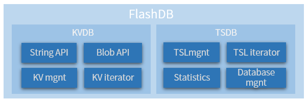
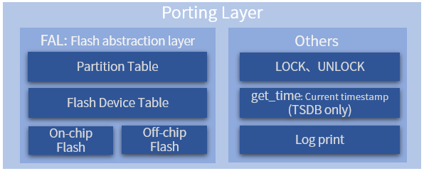

# 简介

## 数据库模式

FlashDB 是一款超轻量级的嵌入式数据库(Easyflash 的升级版)，提供两种数据库模式：

| 数据块模式 | 存储形式                            | 特点                                           | 使用场景                                       |
| ---------- | ----------------------------------- | ---------------------------------------------- | ---------------------------------------------- |
| 键值数据库 | 将数据存储为键值（Key-Value）对集合 | 操作简洁，可扩展性强                           | 产品参数存储<br>用户配置信息存储<br>小文件管理 |
| 时序数据库 | 将数据按照时间顺序存储              | 数据具有时间戳，数据存储量大，插入及查询性能高 | 储动态产生的结构化数据<br> 记录运行日志        |

## 功能框图



# 移植

## 移植框图

FlashDB 底层的 Flash 管理及操作依赖于 RT-Thread 的 FAL Flash 抽象层开源软件包, **只需要将所用到的 Flash 对接到 FAL ，即可完成整个移植工作**.


- FAL 底层将不同的 Flash 存储介质进行了统一封装，并提供了分区表机制，暴露给上层用户
- FlashDB 的每个数据库就是基于 FAL 提供的分区机制，每个数据库都坐落在某个 FAL 的分区上，相当于**一个分区对应一个数据库**

## FAL 移植

### 定义 flash 设备

定义具体的 Flash 设备对象，需要:

1. 根据自己的 Flash 情况分别实现 init、 read、 write、 erase 这些操作函数
2. 定义`struct fal_flash_dev`类型的 flash 对象, 指定各个参数和上面实现的 ops 函数

完成后效果如下:

```c
struct fal_flash_dev g_flashdb0 =
{
    .name       = FLASHDB_DEV_NAME,
    .addr       = 0,
    .len        = 0,
    .blk_size   = FLASH_ERASE_MIN_SIZE,
    .ops        = {init, read, write, erase},
    .write_gran = 8
};
```

### 定义 flash 设备表

在`fal_cfg.h`中定义`FAL_FLASH_DEV_TABLE`, 将上面定义的 flash 对象放在里面:

```c
extern struct fal_flash_dev g_flashdb0;

/* flash device table */
#define FAL_FLASH_DEV_TABLE                                          \
{                                                                    \
    &g_flashdb0,                                                     \
}
```

### 定义 flash 分区表

Flash 分区基于 Flash 设备，每个 Flash 设备又可以有 N 个分区，这些分区的集合就是分区表, 定义在在`fal_cfg.h`中.
用户需要修改的分区参数包括：分区名称、关联的 Flash 设备名、偏移地址（相对 Flash 设备内部）、大小:

```c
#define NOR_FLASH_DEV_NAME             "norflash0"
/* ====================== Partition Configuration ========================== */
#ifdef FAL_PART_HAS_TABLE_CFG
/* partition table */
#define FAL_PART_TABLE                                                               \
{                                                                                    \
    {FAL_PART_MAGIC_WORD, FLASHDB_KVDB_PATH,  FLASHDB_DEV_NAME, CONFIG_FLASHDB_KVDB_START_ADDR, CONFIG_FLASHDB_KVDB_SIZE, 0},
    {FAL_PART_MAGIC_WORD, FLASHDB_TSDB_PATH,  FLASHDB_DEV_NAME, CONFIG_FLASHDB_TSDB_START_ADDR, CONFIG_FLASHDB_TSDB_SIZE, 0},
}
#endif /* FAL_PART_HAS_TABLE_CFG */
```

# API 说明

官方文档很详细, 参考[api.md](https://github.com/armink/FlashDB/blob/master/docs/zh-cn/api.md)
