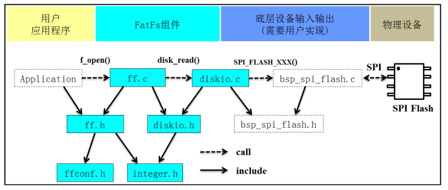
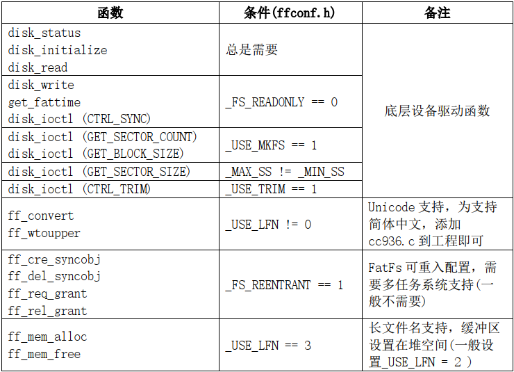

FATFS 是一个完全免费开源，专为小型嵌入式系统设计的 FAT（File Allocation Table）文件系统模块, 支持 FAT12/FAT16/FAT32，支持多个存储媒介，有独立的缓冲区，可对多个文件进行读写, 兼容 Windows 文件系统.

# 源码结构

fatfs 的层次结构和源码对应关系如下:

- 用户应用程序需要由用户编写，一般我们只用到 `f_mount`、 `f_open`、 `f_write`、 `f_read`就可以实现文件的读写操作。
- FatFs 组件是 FatFs 的主体，实现了 FAT 文件读写协议，其中 ff.c、 ff.h、 integer.h 以及 diskio.h 四个文件我们不需要改动，只需要修改 ffconf.h 和 diskio.c 两个文件。
- 底层设备输入输出要求实现存储设备的读写操作函数、存储设备信息获取函数等, 是移植的主要接口

# 移植

FATFS 的移植主要分为三步：

- 数据类型：在 integer.h 里面去定义好数据的类型
- 配置：通过 ffconf.h 配置 FATFS 相关功能
- 函数编写：在 diskio.c 文件中进行底层驱动编写

移植的主体任务是实现实际设备和 fatfs 之间的驱动接口, 根据功能配置的不同, 对应不同的函数. 基本关系如下:

**移植时一般只实现前六个函数就满足了大部分功能**.
