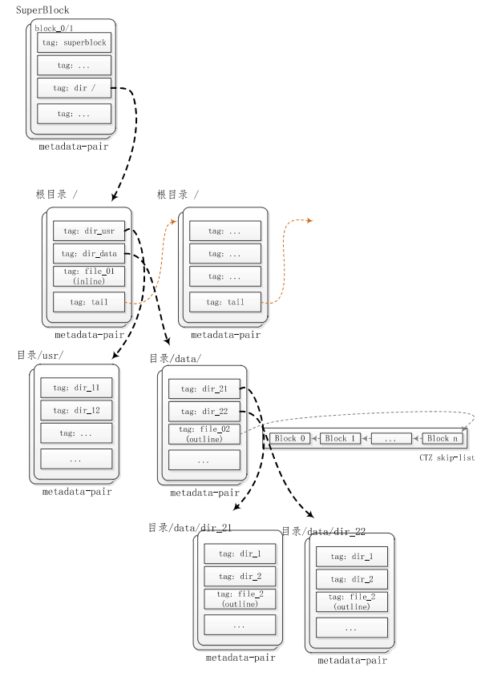
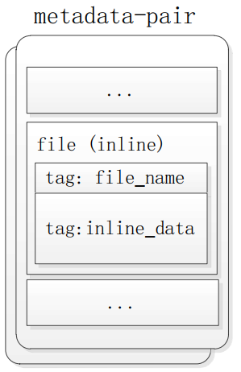
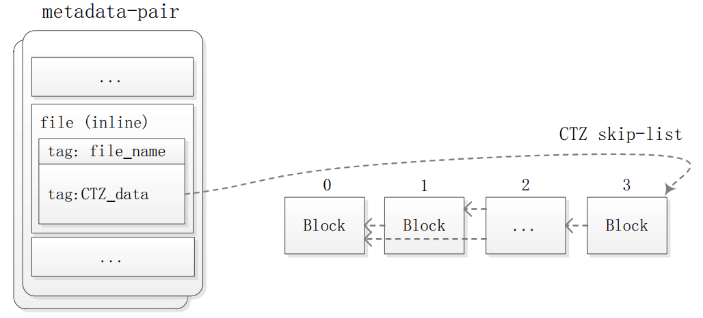
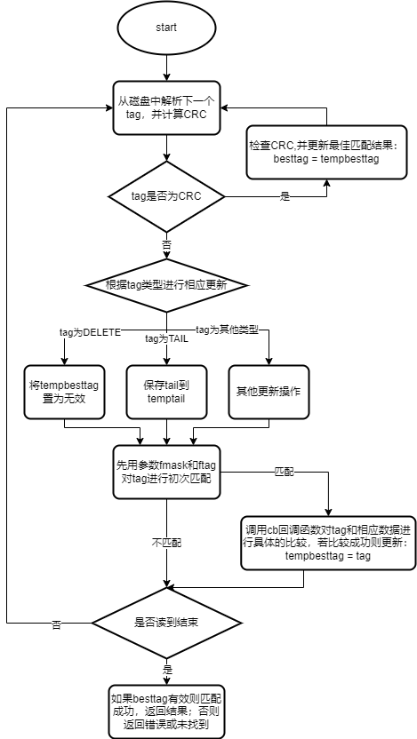
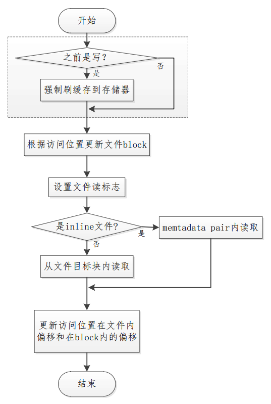
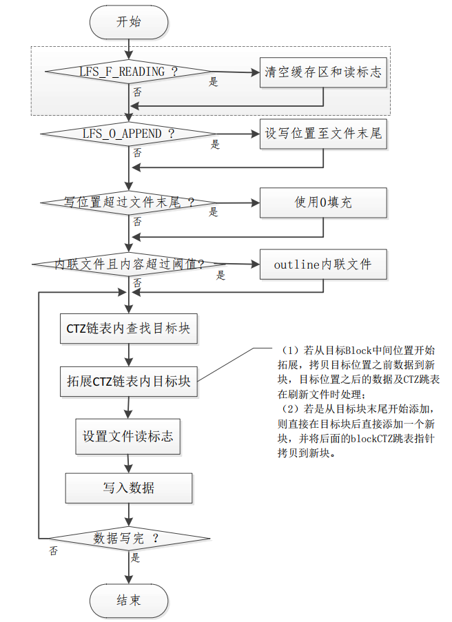

LittleFS 是 ARM mbedOS 的官方推荐文件系统, 主要用在微控制器和 flash 上，具有轻量级，掉电安全的特性.

# 对比

## fatfs 的缺陷

- 一个文件分配了空间就固定不变, 频繁写文件会频繁擦除 flash 的固定地址, 容易导致块坏掉
- 掉电不安全. 要写数据需要对整个扇区执行`读+擦除+回写`过程, 容易在过程中出现故障

## littlefs 的特点

- 掉电恢复, 在写入时即使复位或者掉电也可以恢复到上一个正确的状态。
- 擦写均衡, 有效延长 flash 的使用寿命
- 节省 ROM 和 RAM 空间

# littlefs 内部逻辑

## 基本结构



1. littlefs 文件系统初始化时，会在 SPI Flash 最开始的两个块中格式化出两个超级块，用于对文件系统的识别及根目录的索引；
2. 在建立文件或目录时，littlefs 会从超级块中分配一个页用于记录文件的基本信息，并建立文件数据的索引以找到文件的具体数据内容；
3. **当文件大小小于一个块大小时，尽管文件系统不对超出的部分索引，但其他文件仍然不能使用这个块的剩余部分，所以一个文件至少占用一个块大小**；
4. 如果写入到文件中的数据超过一个块大小时，文件系统会在各个块中建立联系，确保数据的联系性，但各个块在物理地址上不一定连续；
5. 当在一个文件中追加数据时，文件系统会复制源文件中最后不足一个块的数据到一个新的块，然后在新的块中追加要写入的数据，也就是 littlefs 的“磨损均衡”；
6. 接上边第五条，在数据写入时，littlefs 每次都会新开辟一个数据块，然后在新的数据块中添加要写入的数据，即便是对原文件覆盖写入也同样开辟一个新的块，待整个块写满或数据写完时才更新文件索引，让新的数据块在文件链路中生效， 由于数据写入的较慢，而索引更新只需一次写入即可，所以 littlefs 能实现“断电恢复”。

## 文件存储方式

对小于一个 Block 八分之一长度的文件，采用 Inline 类型的方式存储，而大于或者等于 Block 八分之一长度的文件则采用 Outline 的方式存储:

- **inline 存储方式**: 文件内容与文件名称一同存储在其父目录的元数据对(metadata pair)内，一个 Tag 表示其名称，一个 Tag 表示其内容
  
- **outline 存储方式**: 文件其父目录的元数据对（metadata pair）内，一个 Tag 表示文件名称，另一个 Tag 为 CTZ 类型，其指向存储文件内容的链表头
  

## 目录遍历流程



## 文件读流程



## 文件写流程



# 移植

移植的重点是:

- 对 `struct lfs_config` 的赋值；
- LittleFS 读写内存的分配函数指定；
- 使用 `lfs_mount` 挂载文件系统;

## `struct lfs_config`

`struct lfs_config`需要在挂载时指定, 主要属性如下:

```c
struct lfs_config {
    // 用于传递信息给块设备,便于块设备驱动进行特定的处理，比如：告诉块设备驱动具体哪个范围用于文件系统(传参)；
    // 这个内容的数据结构由块设备驱动来定义;
    void *context;

    // 读接口, 由设备驱动提供
    int (*read)(const struct lfs_config *c, lfs_block_t block, lfs_off_t off, void *buffer, lfs_size_t size);
    // 写接口，由设备驱动提供，这个块必须是已经被擦除的(文件系统会确保擦除)
    int (*prog)(const struct lfs_config *c, lfs_block_t block, lfs_off_t off, const void *buffer, lfs_size_t size);
    //擦除接口, 由设备驱动提供, 擦除一个块
    int (*erase)(const struct lfs_config *c, lfs_block_t block);
    // 同步接口, 由设备驱动提供, 有的块设备需要有缓存, 需要同步才能将缓存的内容写入
    int (*sync)(const struct lfs_config *c);

    // 最小读取字节数，起始地址需要按照这个size对齐, 所有的读取操作字节数必须是它的倍数（影响内存消耗）
    lfs_size_t read_size;
    // 最小写入字节数，起始地址需要按照这个size对齐, 所有的写取操作字节数必须是它的倍数（影响内存消耗）
    lfs_size_t prog_size;
    //擦除块字节数 不会影响内存消耗；这个数值可以比物理擦除地址大，但是这个数值应该尽可能小，因为每个文件至少占用一个块；值必须是读取和编程粒度的整数倍；
    lfs_size_t block_size;
    // 可以被擦除的块数量，取决于设备容量
    lfs_size_t block_count;
    //littlefs逐出元数据日志并将元数据移动到另一个块之前的擦除周期数。 建议值在100-1000范围内，较大的值具有较好的性能，但是会导致磨损分布不均匀。
    // -1 禁用块级磨损均衡
    int32_t block_cycles;
    //块缓存的大小。 每个缓存都会在RAM中缓冲一部分块。littlefs需要一个读缓存，一个程序缓存以及每个文件一个额外的缓存。
    //更大的缓存可以通过存储更多数据来减少磁盘访问次数来提高性能。该值必须是读取和编程大小的倍数，并且是块大小的因数。
    lfs_size_t cache_size;
    // 块分配时的预测深度（分配块时每次步进多少个块），这个数值必须为8的整数倍，如1024表示每次预测1024个block。这个值对于内存消耗影响不大
    lfs_size_t lookahead_size;

    // 可选参数, 用于静态分配读缓存, 应该等于cache_size
    void *read_buffer;
    // 可选参数, 用于静态分配写缓存, 应该等于cache_size
    void *prog_buffer;
    // 可选参数, 用于静态分配预测缓存, 应该等于lookahead_size/8
    void *lookahead_buffer;
};
```

## 动态内存配置

由于嵌入式系统不一定支持 heap, 因此 lfs 同时支持静态和动态内存两种方式，使用 `LFS_NO_MALLOC` 来进行开启关闭，当未定义 `LFS_NO_MALLOC` 时，用户需要提供自己的内存申请以及释放函数.

不支持 heap 的系统, 除了定义这个宏, 还需要将`lfs_config`中的几个 buffer 参数设置为静态内存. <font color='red'>若要支持打开多个文件, heap 是必须的</font>

# 示例

```c
const struct lfs_config cfg = {
    // block device operations
    .read  = user_provided_block_device_read,
    .prog  = user_provided_block_device_prog,
    .erase = user_provided_block_device_erase,
    .sync  = user_provided_block_device_sync,

    // block device configuration
    .read_size = 16,
    .prog_size = 16,
    .block_size = 4096,
    .block_count = 16,
    .cache_size = 16,
    .lookahead_size = 16,
    .block_cycles = 500,
};

void lfs_test()
{
    lfs_t lfs = {0};
    lfs_file_t file = {0};

    //挂载设备
    int err = lfs_mount(&lfs, &cfg);
    // 第一次挂载失败, 可能因为没有格式化
    if (err)
    {
        lfs_format(&lfs, &cfg);
        LFS_TEST_LOG("lfs format\r\n");
        err = lfs_mount(&lfs, &cfg);
    }
    if(!err)
        LFS_TEST_LOG("lfs mount OK!\n");
    else
    {
        LFS_TEST_LOG("lfs mount fail!\n");
        goto exit;
    }

    lfs_file_open(&lfs, &file, "test.txt", LFS_O_RDWR | LFS_O_CREAT);

    char cbuffer[256] = {0};
    lfs_file_read(&lfs, &file, cbuffer, sizeof(cbuffer)-1);
    LFS_TEST_LOG("%s\n", cbuffer);

    strcpy(cbuffer," w lfs test!");
    lfs_file_write(&lfs, &file, cbuffer, strlen(cbuffer));
    lfs_file_sync(&lfs, &file);

    memset(cbuffer,0,sizeof(cbuffer));
    lfs_file_rewind(&lfs, &file);
    lfs_file_read(&lfs, &file, cbuffer, sizeof(cbuffer)-1);
    LFS_TEST_LOG("\r\n%s\n", cbuffer);

    lfs_file_close(&lfs, &file);
    lfs_unmount(&lfs);

exit:
    return;
}
```

# littlefs 镜像生成工具

mklittlefs 是 littlefs 镜像打包和解析工具.
打包和解码等基本命令一样:

```bash
# 打包
mklittlefs -c littlefs/ -b 4096 -p 256 -s 65536 littlefs.bin

# 解析
mklittlefs -u littlefs/ -b 4096 -p 256 -s 65536 littlefs.bin

# 查看
mklittlefs -l -b 4096 littlefs.bin
```

# 注意事项

## 配置注意事项

- read_size 和 prog_size 不要太大了，不然会频繁的触发压缩过程。
- 在保证内存的情况下，lookahead_size 越大越好，因为 lookahead 窗口的建立过程消耗的时间，不受 lookahead_size 的影响。lookahead 窗口用 1bit 代表 1 个 block size，其实对内存的开销也还好。
- block_cycles 越小，擦写均衡的效果越好，但是写入抖动的频率会越高。
- cache_size 一般和 block size 对齐就好了。

## 实际使用注意事项

- 不要同时 open 太多文件，每 open 一个文件，没有 close 的情况下，会增加 cache_size 大小的内存开销。
- write 完数据要尽快的 close，因为只有 close 操作完成了，异常掉电后，write 的数据才能被文件系统正确检索。
- 一个目录下面不要放太多的文件，不然压缩的过程（write 的抖动）时间会比较大。
- 文件的大小尽可能小于 1 个 block size，如果大于 1 个 block size，那么尽可能按照 ctz 特性来设计文件大小，不然可能性能比想象的差，例如文件大小为 8192（占据三个 ctz block），比文件大小为 8000（占据两个 ctz block），要差很多。
- 对写时延要求比较高的文件，尽量放到一级目录，写时间会短一些

# 常见问题

## error: No more free space

因为这里代码上报此错误：

```c
// check if we have looked at all blocks since last ack
if (lfs->free.ack == 0) {
    LFS_ERROR("No more free space %"PRIu32,
            lfs->free.i + lfs->free.off);
    return LFS_ERR_NOSPC;
}
```

解决方法:

1. 增大`lookahead_size`和`cache_size`

## error: Corrupted dir pair at

1. 整个磁盘擦除后会出现一次,因为需要重新 mkfs,创建全新的根目录
1. 之后出现意味着磁盘数据被改写,导致文件系统元数据出现错误

## 读取速度慢

测试发现, 对于 block size 比较大的 flash, 生成的 littlefs.bin 会比较大(即使实际保存的文件并不大), 会影响读取时的速度.
如下测试的结果:

```log
# 32M
cpu1:0s:18274):prvHeapInit-psram start addr:0x60002000, size:7531846
cpu1:(8762):renxiuhu in _lv_img_cache_open:132 src:/spi/png/icon_wifi_full.png,time cost:1366
cpu1:(10152):renxiuhu in _lv_img_cache_open:132 src:/spi/png/icon_open.png,time cost:1388
cpu1:(11582):renxiuhu in _lv_img_cache_open:132 src:/spi/png/icon_light.png,time cost:1430
cpu1:(13024):renxiuhu in _lv_img_cache_open:132 src:/spi/png/icon_collect.png,time cost:1442
cpu1:(14494):renxiuhu in _lv_img_cache_open:132 src:/spi/png/icon setting.png,time cost:1470
cpu1:(15866):renxiuhu in _lv_img_cache_open:132 src:/spi/png/icon_lock.png，time cost:1370
cpu1:(17274):renxiuhu in _lv_img_cache_open:132 src:/spi/png/icon_power.png,time cost:1408
cpu1:spi:W(18164):rx overflow int triggered
cpu1:(18984):renxiuhu in _lv_img_cache_open:132 src:/spi/png/home/food1.pngtime cost:1694
cpu1:(20660):renxiuhu in _lv_img_cache_open:132 src:/spi/png/home/food2.png,time cost:1674
cpu1:(22338):renxiuhu in _lv_img_cache_open:132 src:/spi/png/home/food3.png,time cost:1676
cpu1:(24006):renxiuhu in _lv_img_cache_open:132 src:/spi/png/home/food4.png,time cost:1666
cpu1:lcd_pip:I(24052):display start, frame width, height 480,854

# 4M
cpu1:os:I(1870): prvHeapInit-psram start addr:0x60002000, size:7331840
cpu1:(1974):renxiuhu in _lv_img_cache_open:132 src:/spi/png/icon_wifi_full.png,time cost: 206
cpu1:(2132):renxiuhu in _lv_img_cache_open:132 src:/spi/png/icon_open.png,time cost: 156
cpu1:(2314):renxiuhu in _lv_img_cache_open:132 src:/spi/png/icon_light.png,time cost:182
cpu1:(2490):renxiuhu in _lv_img_cache_open:132 src:/spi/png/icon_collect.png,time cost: 176
cpu1:(2644):renxiuhu in _lv_img_cache_open:132 src:/spi/png/icon_setting.png,time cost: 154
cpu1:(2820):renxiuhu in _lv_img_cache_open:132 src:/spi/png/icon_lock.png,time cost: 174
cpu1:(2996):renxiuhu in _lv_img_cache_open:132 src:/spi/png/icon_power.png,time cost: 176
cpu1:(3304):renxiuhu in _lv_img_cache_open:132 src:/spi/png/food1.png,time cost: 292
cpu1:(3620):renxiuhu in _lv_img_cache_open:132 src:/spi/png/food2.png,time cost: 316
cpu1:(3958):renxiuhu in _lv_img_cache_open:132 src:/spi/png/food3.png,time cost: 336
cpu1:(4302):renxiuhu in _lv_img_cache_open:132 src:/spi/png/food4.png,time cost: 342
cpu1:lcd_pip:I(4356): display start, frame width, height 480， 854
```

通过加 log 计算时间发现，bin 文件过大时主要时间浪费在打开文件阶段, 主要集中在`lfs_dir_find`函数：

```log
cpu1:(33530):renxiuhu in lfs_file_open:5479, tick:33530
cpu1:(34100):renxiuhu in lfs_file_open:5488, tick:34100

cpu1:(34100):renxiuhu in lfs_file_seek:5589, tick:34100
cpu1:(34100):renxiuhu in lfs_file_seek:5598, tick:34100

cpu1:(34100):renxiuhu in lfs_file_flushedread:3255, tick:34100, size=8
cpu1:(34108):renxiuhu in lfs_file_flushedread:3303, tick:34108

cpu1:(34108):renxiuhu in lfs_file_close:5518, tick:34108
cpu1:(34108):renxiuhu in lfs_file_close:5526, tick:34108

cpu1:(34108):renxiuhu in lv_img_decoder_get_info:105, src:/spi/png/home/food1.png, time cost:578
```
