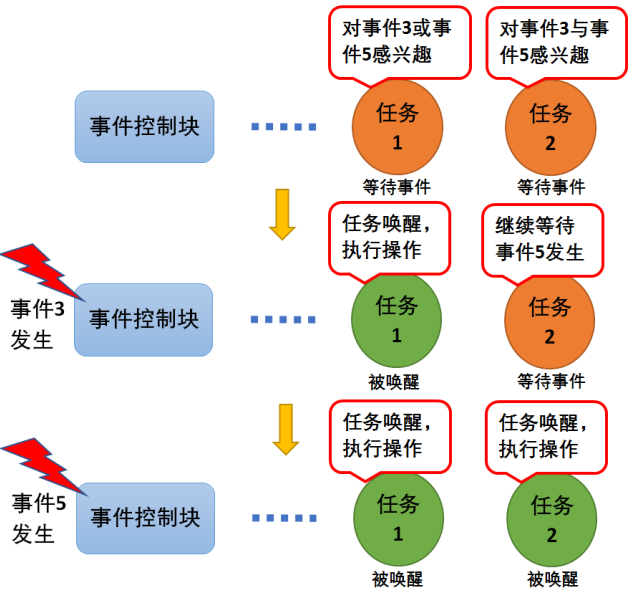

# event group

## 基本特点

FreeRTOS 提供的事件组具有如下特点

- 事件只与任务相关联，事件之间相互独立, 每个 bit 表示一种事件类型(0=未发生, 1=已发生)
- 事件仅用于同步，不能进行数据传输
- 事件无排队性，即多次向任务设置同一事件(如果任务还未来得及读走)， 等效于只设置一次
- 允许多个任务对同一事件进行读写操作
- 支持事件等待超时机制

## 运行原理

任务因为等待某个或者多个事件发生而进入阻塞态，当事件发生的时候会被唤醒


## 数据结构

### EventGroup_t

`EventGroup_t`定义了事件组的结构, 主要包含保存事件状态的变量和阻塞的 task

```c
typedef struct EventGroupDef_t
{
    EventBits_t uxEventBits; //包含高8位的control bits和事件bits
    List_t xTasksWaitingForBits; /*< List of tasks waiting for a bit to be set. */
} EventGroup_t;
```

### control bits

`uxEventBits`中高 8 位用于控制字段, 不同位代表不同的含义, 目前只用到了 3 个:

- `eventCLEAR_EVENTS_ON_EXIT_BIT`: 等待的事件发生后是否清除响应 bit
- `eventUNBLOCKED_DUE_TO_BIT_SET`: 标记任务是否是因为事件发生而唤醒的
- `eventWAIT_FOR_ALL_BITS`: 同时等待的多个事件是否是逻辑与关系

# event 函数

| 函数                        | 作用                          |
| --------------------------- | ----------------------------- |
| xEventGroupCreate           | 创建 event group              |
| xEventGroupCreateStatic     | 静态创建 event group          |
| xEventGroupWaitBits         | 等待某个/某些事件发生         |
| xEventGroupClearBits        | 将指定事件位清零              |
| xEventGroupClearBitsFromISR | 将指定事件位清零,中断处理使用 |
| xEventGroupSetBits          | 将指定事件位置 1              |
| xEventGroupSetBitsFromISR   | 将指定事件位置 1,中断处理使用 |
| vEventGroupDelete           | 删除 event group              |

## 创建事件组

以`xEventGroupCreate`为例:

```c
xEventGroupCreate:
    //申请内存
    pxEventBits = ( EventGroup_t * ) pvPortMalloc( sizeof( EventGroup_t ) );
    //初始化event group
    if( pxEventBits != NULL )
        pxEventBits->uxEventBits = 0;
        vListInitialise( &( pxEventBits->xTasksWaitingForBits ) );
    //返回event group
    return pxEventBits;
```

## 等待事件发生

通过`xEventGroupWaitBits`可以设置等待事件组中的哪些 bits, 并设置这些 bits 的与或关系, 从而实现等待某些事件或全部事件发生:

```c
xEventGroupWaitBits:
    //判断有没有超过允许的事件bits
    configASSERT( ( uxBitsToWaitFor & eventEVENT_BITS_CONTROL_BYTES ) == 0 );
    //挂起调度器
    vTaskSuspendAll();
    //判断当前事件组的值是否满足wait条件
    xWaitConditionMet = prvTestWaitCondition( uxCurrentEventBits, uxBitsToWaitFor, xWaitForAllBits );
        if( xWaitForAllBits == pdFALSE )//逻辑或关系, 有一个满足即可
            if( ( uxCurrentEventBits & uxBitsToWaitFor ) != ( EventBits_t ) 0 )
                xWaitConditionMet = pdTRUE;
        else //逻辑与关系, 所有事件满足才行
            if( ( uxCurrentEventBits & uxBitsToWaitFor ) == uxBitsToWaitFor )
                xWaitConditionMet = pdTRUE;
    //当前条件满足
    if( xWaitConditionMet != pdFALSE )
        uxReturn = uxCurrentEventBits;//返回事件组的所有bits
        //判断xClearOnExit, 需不需要清楚对应bits
    else if( xTicksToWait == ( TickType_t ) 0 )
        //条件不满足, 不阻塞, 返回事件组所有bits
        uxReturn = uxCurrentEventBits;
    else
        //条件不满足, 需要等待某些事件发生
        //使用uxControlBits保存当前函数的一些参数, 等到唤醒时使用
        vTaskPlaceOnUnorderedEventList( &( pxEventBits->xTasksWaitingForBits ), ( uxBitsToWaitFor | uxControlBits ), xTicksToWait );
            //将当前函数的参数保存到task的xEventListItem中
            //将当前task加入到事件组的阻塞task中
            //将task键入到delay list
            prvAddCurrentTaskToDelayedList( xTicksToWait, pdTRUE );
    //恢复调度器
    xAlreadyYielded = xTaskResumeAll();

    //代码走到这里说明任务被唤醒, 原因是超时或等待的事件发生了
    uxReturn = uxTaskResetEventItemValue();//从xEventListItem取出值
    //判断事件组前面的control bits, 是不是因为事件发生而唤醒
    if( ( uxReturn & eventUNBLOCKED_DUE_TO_BIT_SET ) == ( EventBits_t ) 0 )
        //因为超时唤醒, 再判断一次当前是否满足事件
    //如果是因为事件发生唤醒, 直接返回
    //注意最后返回值要清楚前面的control bits, 只返回事件bits
    uxReturn &= ~eventEVENT_BITS_CONTROL_BYTES;
```

## 事件发生置位

`xEventGroupSetBits`用于事件发生时置位, 同时阻塞在该 bit 上的 task 会被唤醒:

```c
xEventGroupSetBits:
    //判断有没有超过允许的事件bits
    configASSERT( ( uxBitsToSet & eventEVENT_BITS_CONTROL_BYTES ) == 0 );
    //挂起调度器
    vTaskSuspendAll();
    //设置事件bit
    pxEventBits->uxEventBits |= uxBitsToSet;
    //遍历事件组的阻塞task list
    while( pxListItem != pxListEnd )
        //从xEventListItem取出wait时保存的参数, 包括control bits和事件bits
        uxBitsWaitedFor = listGET_LIST_ITEM_VALUE( pxListItem );
        uxControlBits = uxBitsWaitedFor & eventEVENT_BITS_CONTROL_BYTES;
        //根据逻辑与或关系, 判断该task要等待的事件是否满足
        //如果满足条件
        if( xMatchFound != pdFALSE )
            vTaskRemoveFromUnorderedEventList( pxListItem, pxEventBits->uxEventBits | eventUNBLOCKED_DUE_TO_BIT_SET );
                //更新xEventListItem中的control bits
                //从事件组的阻塞task list中删除该task
                //将该task加入到ready list中, 并判断优先级是否比当前允许task高, 是否需要切换任务
    //恢复调度器
    ( void ) xTaskResumeAll();
```

## 删除事件组

删除事件组比较简单, 主要是如下操作:

- 遍历阻塞 task list, 将所有阻塞 task 唤醒移除
- 动态创建的话, 释放内存
