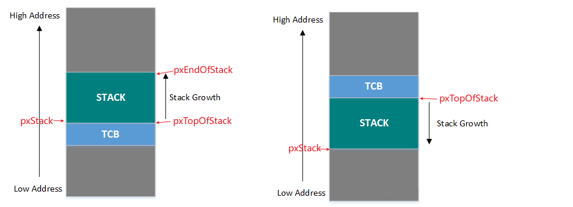

# 获取系统状态

以下函数用于获取系统的状态信息:

- uxTaskPriorityGet()：查询某个任务的优先级
- vTaskPrioritySet()：改变某个任务的任务优先级
- uxTaskGetSystemState()：获取系统中任务状态
- vTaskGetInfo()：获取某个任务信息
- xTaskGetApplicationTaskTag()：获取某个任务的标签(Tag)值
- xTaskGetCurrentTaskHandle()：获取当前正在运行的任务的任务句柄
- xTaskGetHandle()：根据任务名字查找某个任务的句柄
- xTaskGetIdleTaskHandle()：获取空闲任务的任务句柄
- uxTaskGetStackHighWaterMark()：获取任务的堆栈的历史剩余最小值，FreeRTOS 中叫做“高水位线”
- eTaskGetState()：获取某个任务的壮态，这个壮态是 eTaskState 类型
- pcTaskGetName()：获取某个任务的任务名字
- xTaskGetTickCount()：获取系统时间计数器值
- xTaskGetTickCountFromISR()：在中断服务函数中获取时间计数器值
- xTaskGetSchedulerState()：获取任务调度器的壮态，开启或未开启
- uxTaskGetNumberOfTasks()：获取当前系统中存在的任务数量
- vTaskList()：以一种表格的形式输出当前系统中所有任务的详细信息
- vTaskGetRunTimeStats()：获取每个任务的运行时间
- vTaskSetApplicationTaskTag()：设置任务标签(Tag)值
- SetThreadLocalStoragePointer()：设置线程本地存储指针
- GetThreadLocalStoragePointer()：获取线程本地存储指针

# 堆栈溢出检测

## 堆栈检测宏和回调

### 代码逻辑

在 FreeRTOS 源码`vTaskSwitchContext`函数中被调用，也就是在任务上下文切换的时候做检测.

- 实现`vApplicationStackOverflowHook`回调函数, 出现溢出时调用
- 设置`configCHECK_FOR_STACK_OVERFLOW`值:
  - 1: 检查处理器堆栈指针是否仍 在有效堆栈空间内。 如果堆栈指针包含超出有效堆栈范围的值， 则调用堆栈溢出钩子函数.
  - 2: 任务首次创建时，其堆栈会填充一个已知值。 任务退出运行状态时，RTOS 内核可以检查有效堆栈范围内的最后 16 个字节，以确保这些已知值未被任务或中断活动覆盖. 如果这 16 个字节中的任何一个不再为初始值，则调用堆栈溢出钩子函数.
  - 3: 适用于选定的端口。如果可用，该方法将启用 ISR 堆栈检查。检测到 ISR 堆栈溢出时，将触发断言

### 缺陷

**不能保证所有的栈溢出都能检测到:**

- 比如**任务栈末尾的 16 个字节没有用到，即没有被修改，但是任务栈已经溢出了**，这种情况是检测不到的
- 另外任务栈溢出后，任务栈末尾的 16 个字节没有修改，但是溢出部分的栈区的数据修改了，这部分栈区的数据不重要或者暂时没有用到还不会有什么问题，但如果是重要数据被修改将直接导致系统进入硬件异常 Hardfault，这种情况下，栈溢出检测功能也是检测不到的
- 任务执行的过程中出现过栈溢出，但任务切换前栈指针又恢复到了正常水平

## 栈增长方向

堆栈检测需要注意栈的增长方向, 增长方向不同帧尾部位置不同:

- `portSTACK_GROWTH > 0`: 堆栈是向上生长的，先调用 pvPortMalloc 分配任务的 TCB 结构，再去分配任务的 Stack，因为 TCB 大小是固定，但是堆栈要向上生长，这样就避免了堆栈踩到 TCB
- `portSTACK_GROWTH < 0`: 堆栈是向下生长的，先调用 pvPortMalloc 分配任务的 Stack，再去分配任务的 TCB 结构，这样 Stack 生长的时候，也可以避免踩到 TCB 结构
