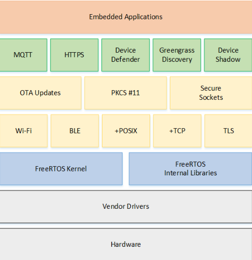

# 简介

FreeRTOS 是一个迷你的实时操作系统内核。FreeRTOS 能在小 RAM 单片机上运行。FreeRTOS 操作系统是完全免费的开源操作系统，具有源码公开、可移植、可裁减、调度策略灵活的特点，可以方便地移植到各种单片机上运行。
作为一个轻量级的操作系统，功能包括：**任务管理、时间管理、信号量、消息队列、内存管理、记录功能、软件定时器、协程**等，可基本满足较小系统的需要。

- FreeRTOS 内核支持**优先级调度算法**，每个任务可根据重要程度的不同被赋予一定的优先级，CPU 总是让处于就绪态的、优先级最高的任务先运行。
- FreeRTOS 内核同时支持**轮换调度算法**，系统允许不同的任务使用相同的优先级，在没有更高优先级任务就绪的情况下，同一优先级的任务共享 CPU 的使用时间。

freeRTOS 的内核可根据用户需要设置为**可剥夺型内核**或**不可剥夺型内核**：

- 当 FreeRTOS 被设置为可剥夺型内核时，处于就绪态的高优先级任务能剥夺低优先级任务的 CPU 使用权，这样可保证系统满足实时性的要求；
- 当 FreeRTOS 被设置为不可剥夺型内核时，处于就绪态的高优先级任务只有等当前运行任务主动释放 CPU 的使用权后才能获得运行，这样可提高 CPU 的运行效率。

## 通用架构



- 一个 FreeRTOS 系统主要由 **BSP 驱动+内核+组件**组成（如上图）。内核包含多任务调度、内存管理、任务间通信的功能，组件包含网络协议、外设支持等。
- FreeRTOS 内核是可剪裁的，组件也是可选的。FreeRTOS 的核心代码只有 9000 行左右。

## 功能特点

- 用户可配置内核功能
- 多平台的支持
- 提供一个高层次的信任代码的完整性
- 目标代码小，简单易用
- 遵循 MISRA-C 标准的编程规范
- 强大的执行跟踪功能
- 堆栈溢出检测
- 没有限制的任务数量
- 没有限制的任务优先级
- 多个任务可以分配相同的优先权
- 队列，二进制信号量，计数信号灯和递归通信和同步的任务
- 优先级继承
- 免费开源的源代码

# 代码结构

```
FreeRTOS-Kernel   The core FreeRTOS kernel files
        |
        +-include   The core FreeRTOS kernel header files
        |
        +-Portable  Processor specific code.
            |
            +-Compiler x    All the ports supported for compiler x
            +-Compiler y    All the ports supported for compiler y
            +-MemMang       内存管理相关，不同的heap文件代表不同的内存管理方式
```

- 根目录下包含核心的代码，分为不同的文件：
  - tasks.c: 任务管理
  - queue.c: 消息队列, 信号量
  - list.c: list 操作函数
  - timers.c: 软件计时器
  - croutine.c: 协程
- `portable/[compiler]/[architecture]`: 每个受支持的处理器架构都需要少量的架构特定 RTOS 代码。这是 RTOS 可移植层。
  - `[compiler]` 和 `[architecture]` 分别是用于创建移植的编译器和运行移植的架构
