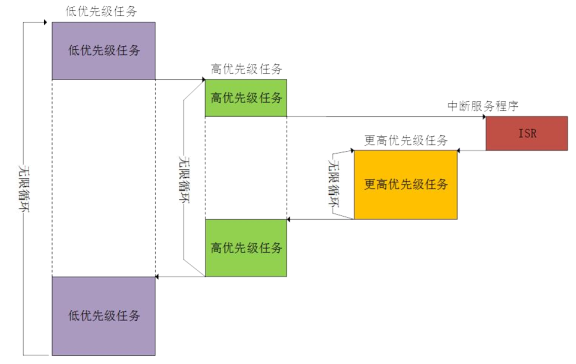
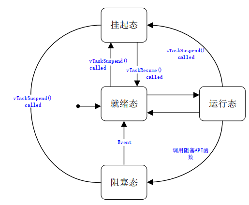
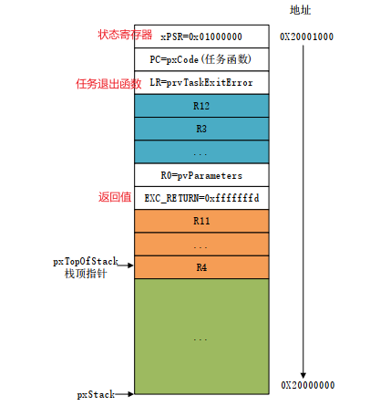
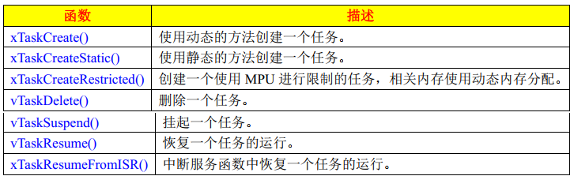
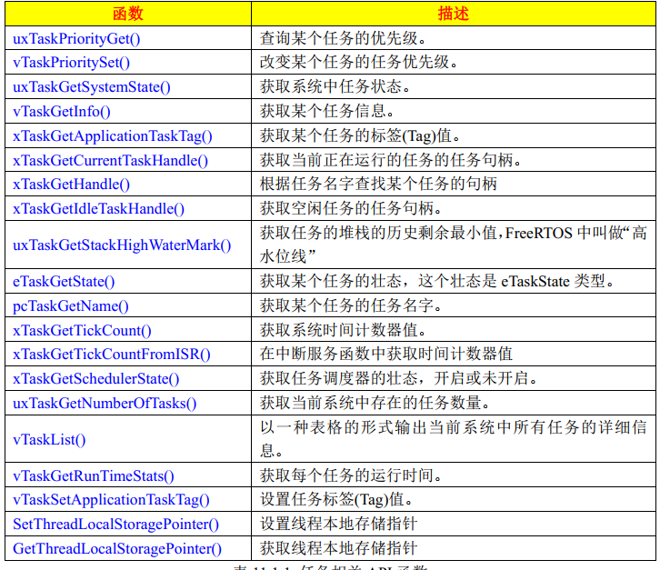

freeRTOS 是一个抢占式的实时多任务系统, 高优先级任务可以打断低优先级任务, 执行完后再将 cpu 使用权还给低优先级任务, 运行过程如图:


# Task

## task 特性

1. 简单, 没有使用限制
1. 支持抢占, 需要考虑重入的问题
1. 支持优先级, **数字越大优先级越高**
1. 每个任务有堆栈, 任务多时 RAM 使用量大

## task 状态



## task 堆栈

任务调度器确保一个 task 开始运行的时候其上下文环境(寄存器值, 堆栈内容等)和上一次退出时一样, 原理如下.

- 每个 task 都有自己的堆栈
- 当 task 退出时上下文环境保存到堆栈中
- 当 task 再次被调度时从堆栈中取出上下文环境

创建任务时堆栈相关的设置:

- 使用`xTaskCreate`动态创建任务, 那堆栈会由函数根据参数`ulStackDepth`自动创建
- 使用`xTaskCreateStatic`静态创建任务, 需要自行申请内存(**一般为数组**), 然后通过参数`pbxStackBuffer`传递首地址

堆栈按照顺序从栈顶开始依次保存如下值(ARM CM 为例):


## task pcb

每个任务都有一些属性需要存储, FreeRTOS 中用`struct TCB_t`表示任务的各个属性, 在创建 task 时会自动给每个任务分配一个控制块.

```c
//task.c中定义, 主要属性有:
typedef struct tskTaskControlBlock
{
    volatile StackType_t * pxTopOfStack; //堆栈的栈顶, 栈顶第一项为任务函数
    StackType_t * pxEndOfStack; //堆栈的栈底
    UBaseType_t uxPriority;//优先级
    StackType_t * pxStack; //堆栈起始地址
    char pcTaskName[ configMAX_TASK_NAME_LEN ]; //任务名称
    UBaseType_t uxCriticalNesting; //临界区保护嵌套层数
    configRUN_TIME_COUNTER_TYPE ulRunTimeCounter; //任务运行总时间
    //task notify相关
    volatile uint32_t ulNotifiedValue[ configTASK_NOTIFICATION_ARRAY_ENTRIES ]; //任务通知值
    volatile uint8_t ucNotifyState[ configTASK_NOTIFICATION_ARRAY_ENTRIES ]; //任务通知状态
    //标记任务时动态创建还是静态创建
    uint8_t ucStaticallyAllocated;
} tskTCB;

typedef tskTCB TCB_t;
```

# Task 函数



## task 创建流程

以`xTaskCreate`为例看看创建 task 的流程:

```c
xTaskCreate:
    //创建堆栈
    pxStack = pvPortMallocStack( ( ( ( size_t ) usStackDepth ) * sizeof( StackType_t ) ) );
    //创建task pcb
    pxNewTCB = ( TCB_t * ) pvPortMalloc( sizeof( TCB_t ) );
    pxNewTCB->pxStack = pxStack;//指向创建好的堆栈
    if( pxNewTCB != NULL )
        //初始化任务
        prvInitialiseNewTask( pxTaskCode, pcName, ( uint32_t ) usStackDepth, pvParameters, uxPriority, pxCreatedTask, pxNewTCB, NULL );
            ( void ) memset( pxNewTCB->pxStack, ( int ) tskSTACK_FILL_BYTE...);//初始化栈
            //设置pcb中栈顶和栈底
            //设置task name和优先级
            //初始化event list和state list
            //初始化堆栈
            pxNewTCB->pxTopOfStack = pxPortInitialiseStack( pxTopOfStack, pxTaskCode, pvParameters );
                //从栈顶开始依次保存上下文信息
        //添加到ready list
        prvAddNewTaskToReadyList( pxNewTCB );
            if( pxCurrentTCB == NULL )//当前没有任务运行
                pxCurrentTCB = pxNewTCB;//新添加任务即为第一个任务
                prvInitialiseTaskLists();//初始化各个任务链表
            else//当前由任务在运行了
                //判断新添加任务优先级是否比正在运行的任务高, 则更新pxCurrentTCB
            //添加到ready list, 同优先级的在同一个list
            prvAddTaskToReadyList( pxNewTCB );
                listINSERT_END( &( pxReadyTasksLists[ ( pxTCB )->uxPriority ] ), &( ( pxTCB )->xStateListItem ) );
            if( xSchedulerRunning != pdFALSE )//调度器已经开始运行
                //根据优先级判断需不需要切换任务
                if( pxCurrentTCB->uxPriority < pxNewTCB->uxPriority )
                    taskYIELD_IF_USING_PREEMPTION();
```

## task 删除流程

```c
vTaskDelete:
    pxTCB = prvGetTCBFromHandle( xTaskToDelete );//获取pcb, 若入参为空, 则返回当前正在运行的任务
    //从任务列表中删除本任务, 可能时ready list 或 delay list
    uxListRemove( &( pxTCB->xStateListItem ) );
    ( void ) uxListRemove( &( pxTCB->xEventListItem ) );
    if( pxTCB == pxCurrentTCB )
        //要删除正在运行的任务, 不能立即释放内存, 需要放到等待终止列表中, 之后在idle task中去释放
        vListInsertEnd( &xTasksWaitingTermination, &( pxTCB->xStateListItem) );
    if( pxTCB != pxCurrentTCB )
        //不是当前任务, 直接释放内存
        prvDeleteTCB( pxTCB );
            vPortFreeStack( pxTCB->pxStack );
            vPortFree( pxTCB );
    if( xSchedulerRunning != pdFALSE )
        //调度器在运行, 如果是删除当前任务, 需要强制进行任务切换
        if( pxTCB == pxCurrentTCB )
            portYIELD_WITHIN_API();

static portTASK_FUNCTION( prvIdleTask, pvParameters )
    for( ; ; )
        prvCheckTasksWaitingTermination();//删除等待终止链表中要是否的任务
            while( uxDeletedTasksWaitingCleanUp > ( UBaseType_t ) 0U )
                pxTCB = listGET_OWNER_OF_HEAD_ENTRY( ( &xTasksWaitingTermination ) );
                ( void ) uxListRemove( &( pxTCB->xStateListItem ) );
                prvDeleteTCB( pxTCB );
```

## task 挂起流程

```c
vTaskSuspend:
    pxTCB = prvGetTCBFromHandle( xTaskToSuspend );//获取pcb, 若入参为空, 则返回当前正在运行的任务
    //从任务列表中删除本任务, 可能时ready list 或 delay list
    uxListRemove( &( pxTCB->xStateListItem ) );
    ( void ) uxListRemove( &( pxTCB->xEventListItem ) );
    //将任务加到挂起链表中
    vListInsertEnd( &xSuspendedTaskList, &( pxTCB->xStateListItem ) );
    if( xSchedulerRunning != pdFALSE )
        //计算下一任务的解锁执行时间，防止有任务的解锁时间参考了刚挂起的任务
        prvResetNextTaskUnblockTime();

    if( pxTCB == pxCurrentTCB )
        //调度器在运行, 如果是挂起当前任务, 需要强制进行任务切换
        if( xSchedulerRunning != pdFALSE )
            portYIELD_WITHIN_API();
        else//调度器没有运行， 手动切换
            if( listCURRENT_LIST_LENGTH( &xSuspendedTaskList ) == uxCurrentNumberOfTasks )
                pxCurrentTCB = NULL;//所有任务都给挂起， 那就没有可执行的任务了
            else
                vTaskSwitchContext();//获取写一个要执行的任务
                    taskSELECT_HIGHEST_PRIORITY_TASK();
```

## task 恢复流程

任务恢复由两个函数, 一个用于任务中, 一个用于中断中, 基本处理流程是一样的.

```c
vTaskResume:
    //判断要恢复的任务是否已经被挂起
    if( prvTaskIsTaskSuspended( pxTCB ) != pdFALSE )
        ( void ) uxListRemove( &( pxTCB->xStateListItem ) );//从挂起链表中删除
        //如果要恢复的任务优先级比当前任务高, 要任务切换
        if( pxTCB->uxPriority >= pxCurrentTCB->uxPriority )
            taskYIELD_IF_USING_PREEMPTION();
                portYIELD_WITHIN_API();
```

# Task 调度器

每个 task 有自己的运行环境, 不依赖其他 task. 任何一个时间点只有一个 task 运行, 具体运行哪个由调度器决定.
**RTOS 的核心是任务管理和任务切换**, 任务切换决定了任务的执行顺序, 任务切换效率的高低决定了一款系统的性能.

## 相关全局变量



## 开始调度

```c
vTaskStartScheduler:
    //根据宏定义, 使用动态或静态方法创建最低优先级的idle task
    #if ( configSUPPORT_STATIC_ALLOCATION == 1 )
        xIdleTaskHandle = xTaskCreateStatic( prvIdleTask, configIDLE_TASK_NAME...);
    #else
        xReturn = xTaskCreate( prvIdleTask, configIDLE_TASK_NAME... &xIdleTaskHandle);
    //根据宏定义, 创建timer task
    #if ( configUSE_TIMERS == 1 )
        xReturn = xTimerCreateTimerTask();
            //保存到全局变量 xTimerTaskHandle

    if( xReturn == pdPASS )
        xSchedulerRunning = pdTRUE; //调度器开始运行
        xTickCount = ( TickType_t ) configINITIAL_TICK_COUNT; //初始化系统启动时间
        xPortStartScheduler(); //需要port.c实现
            //启动硬件tick定时器, 开始tick
            //启动第一个task, 汇编实现, 不同芯片的处理不同
                //加载pxCurrentTCB的堆栈, 恢复上下文并开始执行栈顶的任务函数
```

## 任务切换

任务切换分为两类:

1. 强制任务切换: 上面增删任务时, 可能需要手动调用 API 函数进行任务切换. 常用的: `taskYIELD` 前缀的一系列函数(需要关联 portable 中实现具体的中断触发的`portYIELD`函数)
2. SysTick 自动切换: tick 中断产生时, 在中断处理中自动检查任务, 判断需不需要任务切换

### SysTick 中断

以 ARM_CM4_MPU 为例, tick 中断会调用`xPortSysTickHandler`函数触发 PendSV 中断, 之后在 PendSV 处理中完成任务切换

```c
xPortSysTickHandler:
    //增加计数器xTickCount, 并检查delay list中是否有需要解锁的任务
    xTaskIncrementTick();
        if( uxSchedulerSuspended == ( UBaseType_t ) pdFALSE )
            xTickCount = xConstTickCount;//增加计数器
            if( xConstTickCount >= xNextTaskUnblockTime )//是否delay list有任务到了要解锁的时间
                //从delay list中取出第一个任务, 并从list中删除
                pxTCB = listGET_OWNER_OF_HEAD_ENTRY( pxDelayedTaskList );
                listREMOVE_ITEM( &( pxTCB->xStateListItem ) );
                listREMOVE_ITEM( &( pxTCB->xEventListItem ) );
                //加入到ready list
                prvAddTaskToReadyList( pxTCB );
                if( pxTCB->uxPriority > pxCurrentTCB->uxPriority )
                    xSwitchRequired = pdTRUE; //取出的任务比当前运行任务优先级高, 返回true
            //检查ready list中与当前任务同优先级的其他任务, 也返回true
            //检查有yield pending的任务, 也返回true
            if( xYieldPending != pdFALSE )
                xSwitchRequired = pdTRUE;
        else
            //调度器被挂起, 那就没有任务切换了, 只增加tick计数
            ++xPendedTicks;
    //检查前面函数返回值, true表示需要切换任务
    if(...)
        portNVIC_INT_CTRL_REG = portNVIC_PENDSVSET_BIT; //往PendSV bit写入1 触发中断
```

### 强制切换

强制切换调用`taskYIELD`或直接调用`portYIELD`前缀的两个函数, 其实质是一样的:

以 ARM_CM4_MPU 为例:

- `portYIELD`: 触发 SVC 中断, 在`vPortSVCHandler`中切换任务
- `portYIELD_WITHIN_API`: 触发 PendSV 中断, 在`xPortPendSVHandler`中切换任务
