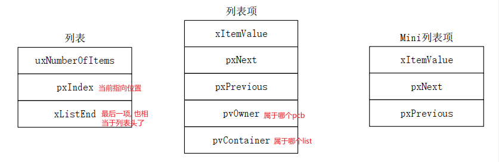
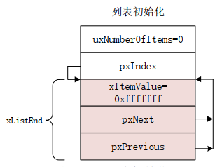
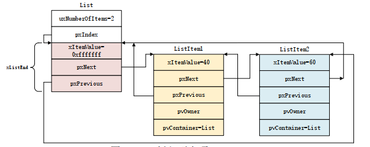
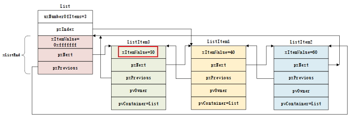

# 数据结构

freeRTOS 中使用`struct List_t`表示一个双向链表, 其中包含列表项`ListItem_t`和迷你列表项`MiniListItem_t`, **链表最后一项必须为`MiniListItem_t`且不计入`uxNUmberOfItems`, 也就是链表的 head**.
三个结构体的基本内容如下:

# list 函数

- `vListInitialise`: 初始化列表, 初始化后只有一个 head, 如下所示:
  
- `vListInitialiseItem`: 初始化一个列表项
- `vListInsert`: 插入一个列表项, 按照值**从小到大排列**. 如下所示:
  
- `vListInsertEnd`: 插入一个列表项到列表末尾(即 xListEnd 的 next), **不遵循顺序**
  
- `uxListRemove`: 删除列表项
