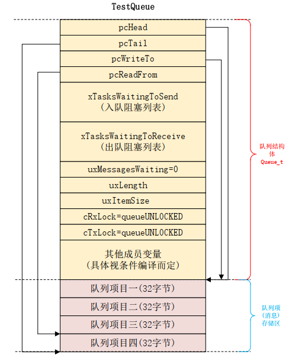

队列用于一个任务或中断处理函数发送消息给另一个任务, 消息需要缓存在消息队列中等待处理.

# freeRTOS 队列

## 特点

- 提供 FIFO 和 LIFO 两种缓存机制
- 传递消息可以采用值传递和引用传递
- **队列不属于某个特定的任务**, 任何任务都可以存取
- 支持**入队阻塞和出队阻塞**
  - 从队列读取消息无效时的阻塞时间
  - 向队列发送消息但队列已满的阻塞时间
- 支持不同的队列类型
- 支持多种入队方式: 队头, 队尾, 覆写

## 队列类型

| 类型                               | 含义           |
| ---------------------------------- | -------------- |
| queueQUEUE_TYPE_BASE               | 普通的消息队列 |
| queueQUEUE_TYPE_SET                | 队列集         |
| queueQUEUE_TYPE_MUTEX              | 互斥信号量     |
| queueQUEUE_TYPE_COUNTING_SEMAPHORE | 计数型信号量   |
| queueQUEUE_TYPE_BINARY_SEMAPHORE   | 二值信号量     |
| queueQUEUE_TYPE_RECURSIVE_MUTEX    | 递归互斥锁     |

## `struct Queue_t`

freeRTOS 使用`struct Queue_t`描述消息队列, 基本属性如下:

```c
typedef struct QueueDefinition
{
    int8_t *pcHead;    //指向队列的开始位置
    int8_t *pcTail;    //指向队列的结束位置
    int8_t *pcWriteTo; //指向下一个可写的空闲内存

    union
    {
        QueuePointers_t xQueue; //指向队列的最后一个消息, 和当前读取位置
        SemaphoreData_t xSemaphore; //队列类型为互斥锁时的参数
    } u;

    List_t xTasksWaitingToSend;//等待发送任务链表, 因入队阻塞的task
    List_t xTasksWaitingToReceive;//等待接收任务链表, 因出队阻塞的task

    volatile UBaseType_t uxMessagesWaiting;//队列中消息个数
    UBaseType_t uxLength;//队列长度, 即允许的最大消息个数
    UBaseType_t uxItemSize;//每个消息的最大长度, 创建队列时指定

    volatile int8_t cRxLock;//队列lock后, 要求出队的消息个数
    volatile int8_t cTxLock;//队列lock后, 要求入队的消息个数
} xQUEUE;

typedef xQUEUE Queue_t;
```

结构体后面紧跟着存储区域, 结构如下:


# 队列函数

| 函数                                           | 作用                                                         |
| ---------------------------------------------- | ------------------------------------------------------------ |
| xQueueCreate                                   | 动态方法创建队列                                             |
| xQueueCreateStatic                             | 静态方法创建队列                                             |
| xQueueSend <br> xQueueSendToBack               | 发送消息到队尾                                               |
| xQueueSendToFront                              | 发送消息对队首                                               |
| xQueueOverwrite                                | 发送消息到队首, 如果队列已满, 自动覆盖旧消息                 |
| xQueueSendFromISR <br> xQueueSendToBackFromISR | 发送消息到队尾, 用于中断函数                                 |
| xQueueSendToFrontFromISR                       | 发送消息对队首, 用于中断函数                                 |
| xQueueOverwriteFromISR                         | 发送消息到队首, , 用于中断函数. 如果队列已满, 自动覆盖旧消息 |
| xQueueReceive                                  | 从队列读取并删除消息                                         |
| xQueuePeek                                     | 从队列读取消息, 但不删除                                     |
| xQueueReceiveFromISR                           | 从队列读取并删除消息, 用于中断函数                           |
| xQueuePeekFromISR                              | 从队列读取消息, 但不删除, 用于中断函数                       |
| prvLockQueue                                   | 给队列枷锁                                                   |
| prvUnlockQueue                                 | 解锁队列, 并将连个等待链表中的任务唤醒                       |

## 创建队列

上面两个创建队列的 API 都是调用的`xQueueGenericCreate`:

```c
xQueueGenericCreate:
    //计算queue的大小, 然后申请内存
    xQueueSizeInBytes = ( size_t ) ( uxQueueLength * uxItemSize );
    pxNewQueue = ( Queue_t * ) pvPortMalloc( sizeof( Queue_t ) + xQueueSizeInBytes );
    if( pxNewQueue != NULL )
        //初始化队列
        prvInitialiseNewQueue( uxQueueLength, uxItemSize, pucQueueStorage, ucQueueType, pxNewQueue );
            if( uxItemSize == ( UBaseType_t ) 0 )//消息长度为0 , 说明没有存储区
                pxNewQueue->pcHead = ( int8_t * ) pxNewQueue;//指向结构体起始地址
            else
                pxNewQueue->pcHead = ( int8_t * ) pucQueueStorage;//有存储区, 指向存储区
            //reset队列
            xQueueGenericReset( pxNewQueue, pdTRUE );
                //填充队列结构体的属性
                //初始化结构体中两个链表
            //设置队列类型
            pxNewQueue->ucQueueType = ucQueueType;
```

## 发送消息

上面列出了多个发送消息的 API, 最终都是调用的`xQueueGenericSend`和`xQueueGenericSendFromISR`.

```c
xQueueGenericSend:
    if( ( pxQueue->uxMessagesWaiting < pxQueue->uxLength ) || ( xCopyPosition == queueOVERWRITE )
        //将消息复制到队列
        xYieldRequired = prvCopyDataToQueue( pxQueue, pvItemToQueue, xCopyPosition );
            //队尾入队, 将消息复制到pcWriteTo所指的位置
            //队首入队或覆写, 将消息复制到u.xQueue.pcReadFrom所指位置
        if( listLIST_IS_EMPTY( &( pxQueue->xTasksWaitingToReceive ) ) == pdFALSE )
            //如果有任务阻塞等待接收消息
            xTaskRemoveFromEventList( &( pxQueue->xTasksWaitingToReceive );
                //从链表删除此任务, 并添加到ready list或pending ready list
                if( uxSchedulerSuspended == ( UBaseType_t ) pdFALSE )
                    listREMOVE_ITEM( &( pxUnblockedTCB->xStateListItem ) );
                    prvAddTaskToReadyList( pxUnblockedTCB );
                else
                    listINSERT_END( &( xPendingReadyList ), &( pxUnblockedTCB->xEventListItem ));
            //根据上面函数返回值, 进行任务切换
            queueYIELD_IF_USING_PREEMPTION();
                portYIELD_WITHIN_API();
    else //如果队列已满, 而且不允许覆写
        if( xTicksToWait == ( TickType_t ) 0 )
            //阻塞时间为0, 返回
            return errQUEUE_FULL;
    //如果队列已满, 且阻塞时间不为0, 检查是否超时
    if( xTaskCheckForTimeOut( &xTimeOut, &xTicksToWait ) == pdFALSE )
        if( prvIsQueueFull( pxQueue ) != pdFALSE )
            vTaskPlaceOnEventList( &( pxQueue->xTasksWaitingToSend ), xTicksToWait );
                //添加到等待发送链表
                //将当前任务放入delay list
    else
        return errQUEUE_FULL;
```

## 接收消息

以`xQueueReceive`为例:

```c
xQueueReceive:
    if( uxMessagesWaiting > ( UBaseType_t ) 0 )//队列里有消息
        //从队列复制消息, 并移动u.xQueue.pcReadFrom位置, 相当于删除一个消息
        prvCopyDataFromQueue( pxQueue, pvBuffer );
        //检查等待链表, 是否有任务在等待发送消息
        if( listLIST_IS_EMPTY( &( pxQueue->xTasksWaitingToSend ) ) == pdFALSE )
            //从链表删除消息, 添加到ready list或pending ready list
            xTaskRemoveFromEventList( &( pxQueue->xTasksWaitingToSend );
            //根据上面函数返回值, 进行任务切换
            queueYIELD_IF_USING_PREEMPTION();
    else //队列里没有消息
        if( xTicksToWait == ( TickType_t ) 0 )
            //阻塞时间为0, 返回
            return errQUEUE_EMPTY;
    //如果队列还是空的, 且阻塞时间不为0, 检查是否超时
    if( xTaskCheckForTimeOut( &xTimeOut, &xTicksToWait ) == pdFALSE )
        if( prvIsQueueEmpty( pxQueue ) != pdFALSE )
            vTaskPlaceOnEventList( &( pxQueue->xTasksWaitingToReceive ), xTicksToWait);
                //添加到等待接收链表
                //将当前任务放入delay list
    else
        return errQUEUE_EMPTY;
```
