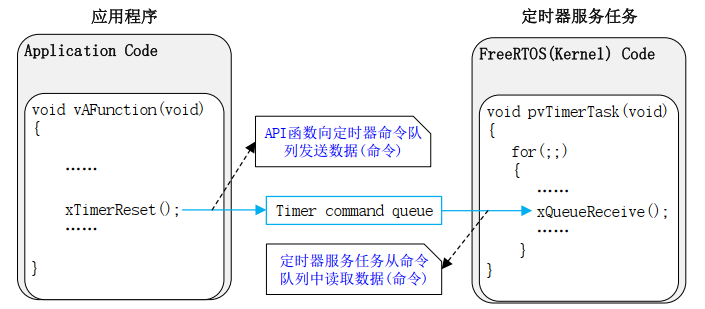

FreeRTOS 提供了**软件定时器**的功能, 虽然没有硬件定时器的精度高, 但是对于精度要求不高的周期性任务时够用的.

# timer task

FreeRTOS 用一个单独的 task 处理 timer 相关的 API 操作, 应用程序调用 API 进行操作, API 会发送命令消息到 timer queue, timer task 从 queue 获取命令, 进行处理:


## 相关的宏

要启用 timer task 和 queue, 需要在`FreeRTOSConfig.h`配置如下的宏

- configUSE_TIMERS: 启动调度器时自动创建 timer task
- configTIMER_TASK_PRIORITY: 定义 timer task 优先级
- configTIMER_TASK_STACK_LENGTH: 定义 timer task 的堆栈大小
- configTIMER_QUEUE_LENGTH: 定义 timer queue 的长度

## 创建过程

在启动调度器时, `vTaskStartScheduler`会调用`xTimerCreateTimerTask`, 可以参照 4_task.md.
`xTimerCreateTimerTask`会创建 timer task 和 queue:

```c
xTimerCreateTimerTask:
    prvCheckForValidListAndQueue();//检查queue是否为空
        if( xTimerQueue == NULL )
            //初始化active timer list 1/2
            //创建queue
            xTimerQueue = xQueueCreate( ( UBaseType_t ) configTIMER_QUEUE_LENGTH, sizeof( DaemonTaskMessage_t ) );
    if( xTimerQueue != NULL )
        //queue不为空, 开始创建timer task
        xReturn = xTaskCreate( prvTimerTask,
                                configTIMER_SERVICE_TASK_NAME,
                                configTIMER_TASK_STACK_DEPTH,
                                NULL,
                                ( ( UBaseType_t ) configTIMER_TASK_PRIORITY ) | po
                                rtPRIVILEGE_BIT,
                                &xTimerTaskHandle );
```

## task 主函数

```c
//timer task主函数
static portTASK_FUNCTION( prvTimerTask, pvParameters )
    for( ; ; )
        //获取timer list中下一个要超时的时间
        xNextExpireTime = prvGetNextExpireTime( &xListWasEmpty );
            //返回当前timer list中第一个timer的时间
            *pxListWasEmpty = listLIST_IS_EMPTY( pxCurrentTimerList );
            xNextExpireTime = listGET_ITEM_VALUE_OF_HEAD_ENTRY( pxCurrentTimerList );

        //处理timer超时
        prvProcessTimerOrBlockTask( xNextExpireTime, xListWasEmpty );
            //timer list不为空, 且当前时间已经超过要超时的时间, 说明timer已经超时
            prvProcessExpiredTimer( xNextExpireTime, xTimeNow );
                ( void ) uxListRemove( &( pxTimer->xTimerListItem ) );//从list中删除该timer
                if( ( pxTimer->ucStatus & tmrSTATUS_IS_AUTORELOAD ) != 0 )
                    prvReloadTimer( pxTimer, xNextExpireTime, xTimeNow );//对于周期性timer, 重启timer
                        //重新添加到timer list
                        //调用timer的cb函数
                    pxTimer->pxCallbackFunction( ( TimerHandle_t ) pxTimer );//调用timer的cb函数
                else
                    //timer还没有超时, 先挂起timer task
                    vQueueWaitForMessageRestricted( xTimerQueue, ( xNextExpireTime - xTimeNow ), xListWasEmpty );
                        //将task放入delay list, 等待到下一个超市时间到了或queue有消息再唤醒

        //处理queue中所有消息
        prvProcessReceivedCommands();
            //遍历queue中所有消息
            while( xQueueReceive( xTimerQueue, &xMessage, tmrNO_DELAY )
                switch( xMessage.xMessageID )
                    //处理API发来的各类命令
```

# timer 结构体

`struct Timer_t`用于表示一个 timer:

```c
typedef struct tmrTimerControl
{
    const char * pcTimerName;                   //timer名字
    ListItem_t xTimerListItem;                  //timer属于哪个timer list
    TickType_t xTimerPeriodInTicks;             //timer的超时周期
    void * pvTimerID;                           //timer id
    TimerCallbackFunction_t pxCallbackFunction; //timer的回调函数
    uint8_t ucStatus;                           //timer状态
} xTIMER;

typedef xTIMER Timer_t;
```

# timer 函数

timer 相关的常用函数如下:

| 函数               | 作用                                       |
| ------------------ | ------------------------------------------ |
| xTimerCreate       | 动态方法创建 timer                         |
| xTimerCreateStatic | 静态方法创建 timer                         |
| xTimerReset        | reset timer, 从当前时间重新计时            |
| xTimerResetFromISR | 中断处理中 reset timer, 从当前时间重新计时 |
| xTimerStart        | 启动 timer                                 |
| xTimerStartFromISR | 中断处理中启动 timer                       |
| xTimerStop         | 关闭 timer                                 |
| xTimerStopFromISR  | 中断处理中关闭 timer                       |

其中, reset/start/stop/change period 这些操作函数都是通过调用`xTimerGenericCommand`发送命令到 timer task.

## timer 创建

以`xTimerCreate`动态创建为例:

```c
xTimerCreate:
    pxNewTimer = ( Timer_t * ) pvPortMalloc( sizeof( Timer_t ) );//申请内存
    pxNewTimer->ucStatus = 0x00;//初始状态为0, 还没有用API设置timer
    //初始化参数
    prvInitialiseNewTimer( pcTimerName, xTimerPeriodInTicks, xAutoReload, pvTimerID, pxCallbackFunction, pxNewTimer );
        prvCheckForValidListAndQueue();//检查timer queue是否为空
        //设置timer结构体的各个属性
```
