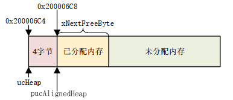
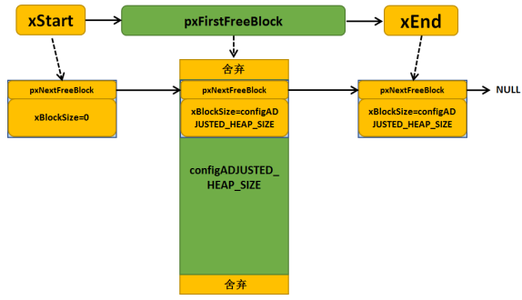
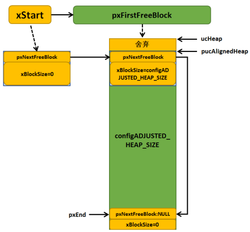
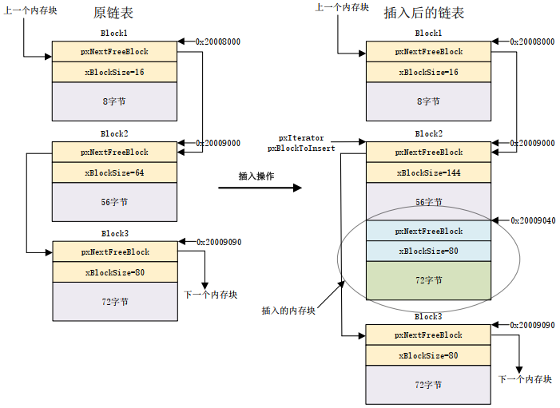
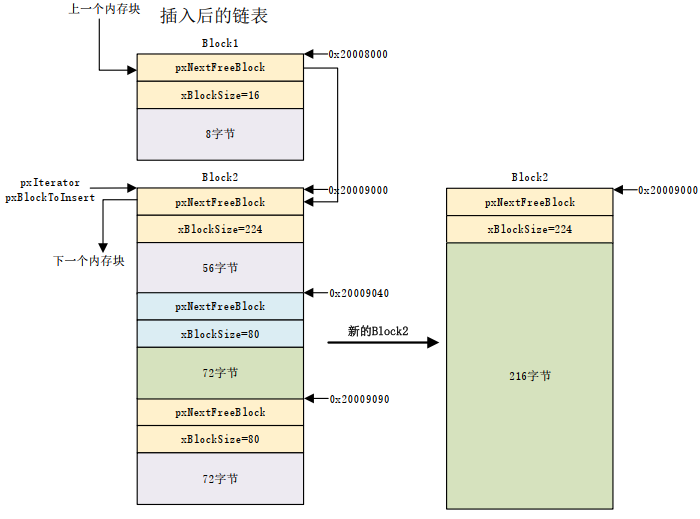
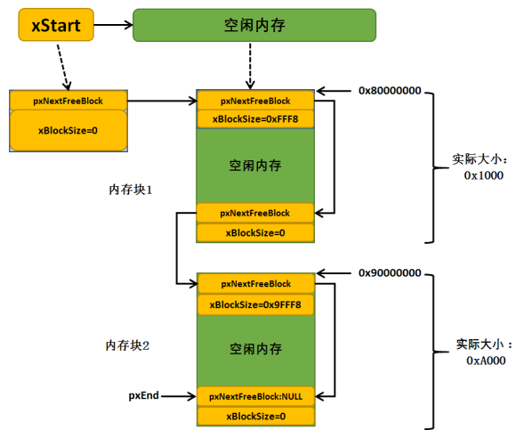

# 为什么不使用 malloc/free?

C 标准库的 malloc 和 free 也可以实现动态内存管理, 但有以下限制因素:

- 在小型嵌入式系统中效率不高
- 会占用很多代码空间
- 不是线程安全
- 不确定性, 每次执行的时间不同
- 会导致内存碎片
- 链接器的配置复杂

所以在 FreeRTOS 中使用`pvPortMalloc`和`pPortFree`代替 C 函数, 并提供 5 种内存分配文件在移植层(`portable/MemMang`)种供自定义配置.
**无论哪种分配方式, 使用的内存堆都是`ucHeap[]`, 大小为`configTOTAL_HEAP_SIZE`.**

# heap_1

实现原理: `ucHeap[]`是一个大数组, 每次申请内存都是数组种获取连续的空间.


heap_1 的特点:

- **内存一旦申请成功就不允许释放**
- 适用于任务/信号量/队列一旦创建就不会删除的应用
- 具有确定性, 执行时间一样, 不会导致内存碎片
- 实现简单, 内存从静态数组中分配

## malloc 实现

```c
pvPortMalloc:
    //根据portBYTE_ALIGNMENT值进行字节对齐
    if( xWantedSize & portBYTE_ALIGNMENT_MASK )
        //字节未对齐, 调整为大于它且距离最近的对齐的数
        xWantedSize += ( portBYTE_ALIGNMENT - ( xWantedSize & portBYTE_ALIGNMENT_MASK ) );
    //暂停调度器, 申请内存的过程不能被打断
    vTaskSuspendAll();

    if( pucAlignedHeap == NULL )
        //获取heap的起始地址, 也要字节对齐
        pucAlignedHeap = ( uint8_t * ) ( ( ( portPOINTER_SIZE_TYPE ) & ucHeap[ portBYTE_ALIGNMENT - 1 ] ) & ( ~( ( portPOINTER_SIZE_TYPE ) portBYTE_ALIGNMENT_MASK) ) );
    //检查要申请的大小是否在可用范围内
    if( ( xWantedSize > 0 ) &&
       ( ( xNextFreeByte + xWantedSize ) < configADJUSTED_HEAP_SIZE ) && //没有超过heap大小
       ( ( xNextFreeByte + xWantedSize ) > xNextFreeByte ) )//没有溢出
        pvReturn = pucAlignedHeap + xNextFreeByte;//返回起始地址
        xNextFreeByte += xWantedSize;//移动可用地址的位置

    //恢复调度器
    xTaskResumeAll();
```

## free 实现

使用 heap_1, 内存一旦申请成功就不允许释放, 所以 free 函数没有内容.

# heap_2

heap_2 也是使用一个静态数组, 但是分配方式不一样, 而且提供了 free 函数. 其特点如下:

- **分配方式比 heap_1 好, 使用内存块, 采样最佳分配算法**
- **支持 free, 但没有内存块合并功能, 会产生内存碎片**
- 可以用在那些反复的删除任务/信号量/队列等内核对象的应用
- 具有不确定性，但是效率比标准 C 库中的 malloc 函数高得多
- 不能用于那些内存分配和释放是随机大小的应用程序

## 内存块

- 每一段分出去的内存是一个 内存块
- 剩余的空闲内存也是一个内存块
- 内存块的大小不定
- <font color='red'>内存块使用链表管理, 按照 size 从小到大排列</font>

内存块结构如下:

```c
typedef struct A_BLOCK_LINK
{
    struct A_BLOCK_LINK * pxNextFreeBlock; //指向下一个block
    size_t xBlockSize;                     //当前block大小 = header大小 + 实际申请大小
} BlockLink_t;
```

系统启动, 刚初始化完成的 heap 只有一个 block, 如下:


## malloc 实现

```c
pvPortMalloc:
    //暂停调度器, 申请内存的过程不能被打断
    vTaskSuspendAll();

    if( xHeapHasBeenInitialised == pdFALSE )
        prvHeapInit(); //heap没有初始化, 先初始化heap
            //heap起始地址对齐
            //初始化xStart, 空的链表head, 指向起始地址, 大小为0
            //初始化xEnd, 大小为heap大小, 表示只有一个block
            //链接xStart和xEnd, 形成只有一个block的链表
    //根据portBYTE_ALIGNMENT值对xWantedSize进行字节对齐, 并加上block header的大小
    //要申请的大小合理, 继续
    if( heapBLOCK_SIZE_IS_VALID( xWantedSize ) != 0 )
        if( ( xWantedSize > 0 ) && ( xWantedSize <= xFreeBytesRemaining ) )
            //while循环, 从Xstart开始查找大小满足需要的block
            if( pxBlock != &xEnd )
                //返回申请到的内存起始地址
                pvReturn = ( void * ) ( ( ( uint8_t * ) pxPreviousBlock->pxNextFreeBlock ) + heapSTRUCT_SIZE );
                //从链表删除当前block, 表示不可用了
                pxPreviousBlock->pxNextFreeBlock = pxBlock->pxNextFreeBlock;
                //如果申请到的block过大, 那就将多余的空间组成一个新的block插入到链表
                if( ( pxBlock->xBlockSize - xWantedSize ) > heapMINIMUM_BLOCK_SIZE )
                    prvInsertBlockIntoFreeList( ( pxNewBlockLink ) );

    //恢复调度器
    xTaskResumeAll();
```

## free 实现

```c
vPortFree:
    puc -= heapSTRUCT_SIZE;//得到block head指针
    pxLink = ( void * ) puc;
    //将block重新插入链表
    //更新剩余空间大小
```

# heap_3

heap_3 方案只是简单的封装了标准 C 库中的 malloc 和 free 函数， 并且能满足常用的编译器。 重新封装后的 malloc()和 free()函数具有保护功能，采用的封装方式是**操作内存前挂起调度器、完成后再恢复调度器**.

- 需要链接器设置一个堆， `configTOTAL_HEAP_SIZE`不起作用
- malloc 和 free 函数由编译器提供。
- 具有不确定性。
- 很可能增大 RTOS 内核的代码大小。

# heap_4

heap_4 方案与 heap_2 的原理一样，不同的是 heap_4 方案还包含了一种合并算法，**能把相邻的空闲的内存块合并成一个更大的块，这样可以减少内存碎片**.

- <font color='red'>内存块使用链表管理, 按照地址从小到大排列</font>
- **在插入内存块时, 会执行合并算法, 合并空闲内存块**
- 可用于重复删除任务、队列、信号量、互斥量等的应用
- 可用于分配和释放随机大小内存的应用， 但并不像 heap2 那样产生严重的内存碎片。
- 具有不确定性，但是效率比标准 C 库中的 malloc 函数高得多。

heap_4 初始化后, 内存块如下所示(与 heap_2 不同):


## 插入时合并 block

`pvPortMalloc`和`pPortFree`和 heap_2 基本一样, 不再重复. 重点关注一下合并算法:

```c
prvInsertBlockIntoFreeList:
    //for循环找到与要插入的block相邻的前一个空闲block
    //如果找到的前一个block的尾部正好是要插入block的头
    if( ( puc + pxIterator->xBlockSize ) == ( uint8_t * ) pxBlockToInsert )
        //说明内存是连续的, 合并!
        pxIterator->xBlockSize += pxBlockToInsert->xBlockSize;
        pxBlockToInsert = pxIterator;
    //如果要插入的block尾部正好是下一个空闲block的头
    if( ( puc + pxBlockToInsert->xBlockSize ) == ( uint8_t * ) pxIterator->pxNextFreeBlock )
        if( pxIterator->pxNextFreeBlock != pxEnd )
            //如果下一block不是end, 合并!
            pxBlockToInsert->xBlockSize += pxIterator->pxNextFreeBlock->xBlockSize;
            pxBlockToInsert->pxNextFreeBlock = pxIterator->pxNextFreeBlock->pxNextFreeBlock;
        else
            pxBlockToInsert->pxNextFreeBlock = pxEnd; //下一block是end, 指向end
    else
        //没有连续内存, 指向下一节点即可

    if( pxIterator != pxBlockToInsert )
        //没有合并, 更新与前一block的链接
        pxIterator->pxNextFreeBlock = pxBlockToInsert;
```

下面图示分别演示了与前后两个 block 内存连续时的合并过程:



# heap_5

heap_5.c 方案在实现动态内存分配时与 heap4.c 方案一样， 采用最佳匹配算法和合并算法. 比 heap_4 多的功能是: **允许内存堆跨越多个非连续的内存区(<font color='red'>即可以有多个 heap</font>)，也就是允许在不连续的内存中实现内存分配**.
比如用户在片内 RAM 中定义一个内存堆，还可以在外部 SDRAM 再定义一个或多个内存堆, 这种情况只能用 heap_5.

## 多 heap 初始化

`vPortDefineHeapRegions`用来对 heap 进行初始化, 参数是`struct HeapRegion_t`的数组, 数组内**按内存地址从小到大定义多个 heap**

```c
//heap示例:
const HeapRegion_t xHeapRegions[] = {
    { ( uint8_t * ) 0x80000000UL, 0x10000 },
    { ( uint8_t * ) 0x90000000UL, 0xa0000 },
    { NULL, 0 } /* 数组结尾 */
};

vPortDefineHeapRegions:
    //遍历每个heap, 然后生成block
    while( pxHeapRegion->xSizeInBytes > 0 )
        //获取heap的起始地址, 并进行字节对齐
        //如果是第一个heap, 则需要初始化xStart
        if( xDefinedRegions == 0 )
            xStart.pxNextFreeBlock = ( BlockLink_t * ) xAlignedHeap;
            xStart.xBlockSize = ( size_t ) 0;
        //获取end, 如果是添加第一个heap, end为空
        pxPreviousFreeBlock = pxEnd;
        //初始化end, 和heap_4一样, end在heap尾部, 每遍历一个heap, 就要初始化一次, 保证end在最后一个heap的尾部
        pxEnd = ( BlockLink_t * ) xAddress;
        pxEnd->xBlockSize = 0;
        //初始化本heap上的唯一一个block
        if( pxPreviousFreeBlock != NULL )
            //如果前一block不为空, 说明不是第一个heap, 则需要链接两个heap的block
            pxPreviousFreeBlock->pxNextFreeBlock = pxFirstFreeBlockInRegion;

        //增加计数, 继续下一个heap
        xDefinedRegions++;
        pxHeapRegion = &( pxHeapRegions[ xDefinedRegions ] );
```

初始化完成后, 结构如下:


**内存的申请和释放和 heap_4 是一样的, 无非是初始化后有多个 block, 其他没有区别**.
