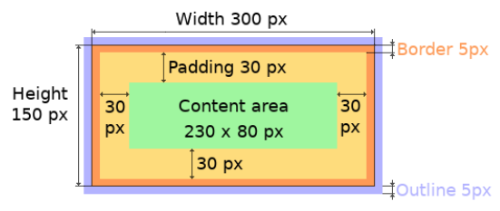
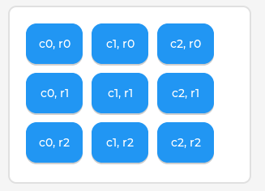
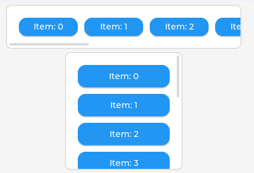

# screen

screen 表示显示的屏幕, 没有父对象. 这里的屏幕用**页面**更好理解.

## 默认页面

在调用`lv_disp_drv_register`注册 draw buffer 和显示驱动函数时会创建`lv_disp_t`对象. 如果是第一个`lv_disp_t`对象， 会被设置为默认显示器，可以通过`lv_scr_act`获取到自动创建的默认页面.

可以同时存在多个`lv_disp_t`, 当默认显示器被删除时, 列表`_lv_disp_ll`中下一个`lv_disp_t`对象会被设置为默认显示器.

## 创建页面

<font color='red'>注意页面和显示器的关系, 一个显示器在注册时会自动创建一个页面对象, 但是一个显示器可以有多个页面对象! </font>
当通过`lv_obj_create(NULL)`创建一个新页面时, 会自动保存到的`lv_disp_t`对象的`screens`数组中.

## 加载页面

有多个页面时, 可以指定`lv_scr_load`选择加载哪个页面来显示数据.

## 屏幕方向

有两种方法设置屏幕方向:

1. 在调用`lv_disp_drv_register`注册设备前设置`lv_vnd_config_t`中`rotation`的值
   - 若参数是 ROTATE_90 和 ROTATE_270 时，需要将显示屏的宽和高进行互换，屏幕的宽度值传入 height 参数，屏幕的高度值传入 width 参数
1. 调用`lv_disp_set_rotation`动态的调整屏幕方向
   - 需要确保被注册设备的`sw_rotate = 1`

# style

## 对象模型

LVGL 对象位置和大小等遵循 CSS 的 box 模型, 需要参数如下:


## 位置大小变换

平移位置需要重新设置对象的 x/y， 需要使用带 `translate` 的函数(在对象渲染完之后平移, 不是重新渲染).
类似的, 要修改对象的大小, 也要使用特点的 style 函数(带 `tramsform` 的函数):

```c
static lv_style_t style_normal;
lv_style_init(&style_normal);
lv_style_set_width(&style_normal, 100);
lv_style_set_height(&style_normal, 20);
lv_style_set_y(&style_normal, 100);

static lv_style_t style_pressed;
lv_style_init(&style_pressed);
lv_style_set_width(&style_pressed, 100);
lv_style_set_height(&style_pressed, 20);
lv_style_set_translate_y(&style_pressed, -20);  //设置向上平移20pix
lv_style_set_transform_width(&style_pressed, 10); //左右两边各增大10
lv_style_set_transform_height(&style_pressed, 10);//左上下两边各增大10

lv_obj_t * btn1 = lv_btn_create(lv_scr_act());
lv_obj_add_style(btn1, &style_normal, LV_STATE_DEFAULT);
lv_obj_add_style(btn1, &style_pressed, LV_STATE_PRESSED);
lv_obj_center(btn1);
```

## 通知 style 更新

当对象的 style 发生变化时, 有如下几种方法让 lvgl 刷新显示对象:

- 调用`lv_obj_invalidate`刷新整个对象或页面
- 调用`lv_obj_refresh_style`刷新对象或页面被更新的 style
- 调用`lv_obj_report_style_change`刷新用到该 style 的所有对象

## theme

theme 是一组 style 的集合，**每个 display 有一个 theme，应用于所有创建的页面对象**。
应用 theme 示例如下：

```c
lv_theme_t * th = lv_theme_default_init(display, /*Use the DPI, size, etc from this,→display*/
                                        LV_COLOR_PALETTE_BLUE, LV_COLOR_PALETTE_CYAN,→ /*Primary and secondary palette*/
                                        false, /*Light or dark mode*/
                                        &lv_font_montserrat_10, &lv_font_montserrat_14, &lv_font_montserrat_18); /*Small, normal, large fonts*/

lv_theme_set_apply_cb(&th_new, new_theme_apply_cb); //设置应用新主题时的回调函数
/*Assign the theme to the display*/
lv_disp_set_theme(display, th);
```

主题之间也可以扩展,有继承关系, 使用`lv_theme_set_parent`扩展已有的 theme(可参照 lvgl 自带的示例`lv_example_style_14`).

# layout

lvgl 支持两种布局(从 CSS 借鉴):

- LV_LAYOUT_GRID: 表格
  
- Flexbox: 分为水平和垂直两种, 超出的对象可以滚动显示
  

# 输入设备

lvgl 支持如下几类输入设备:

- Touchpad
- Mouse (with cursor support)
- Keypad (supports GUI usage only with key)
- Encoder (supports GUI usage only with: left, right, push)
- Button (external buttons to press points on the screen)
