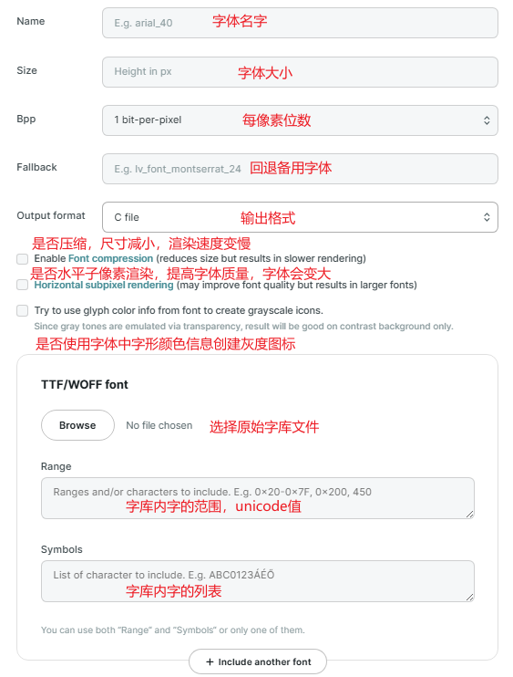
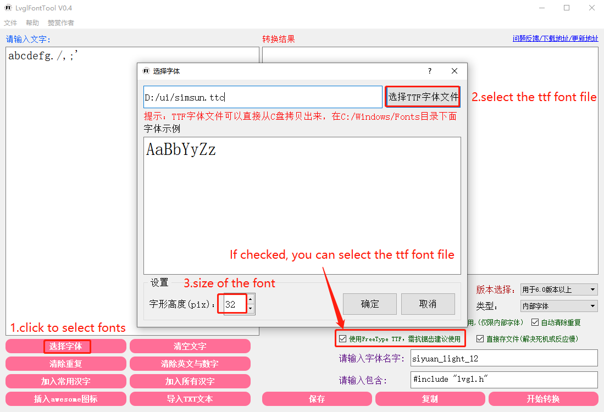

LVGL 目前支持两种字体，一种是`.c`源文件形式的字体，另一种则是`.bin`格式的字体，这两种字体都可以通过官方提供的 lv_font_conv 工具生成. 至于 freetype ttf 类型的字体需要使用 freetype 引擎, 在下一节说明.

# 字体转换工具

## lv_font_conv

有在线版本和 npm 离线版本：


## LvglFontTool

国人开发的工具，功能上更全一些: https://forums.100ask.net/t/topic/328


# c 源文件格式

`.c`格式的字体可以在编译后直接跟随用户程序一同烧入 MCU 之中，并使用 lvgl 的原生接口读取并显示。`.c`格式的字体中，所有数据都是使用 lvgl 标准的数据结构定义的，因此程序可以直接通过寻址的方式读取这些字体，不需要进行任何其他的操作，开销较低，适合 MCU 平台使用.

对于源文件格式, 可以在源文件中看到字体的描述信息和定义:

- 文件开始处的宏与头文件引用
- BITMAPS （glyph_bitmap，保存字符的点阵信息）
- GLYPH DESCRIPTION （glyph_dsc，用于保存字符的大小宽度等信息与在 glyph_bitmap 中的偏移）
- CHARACTER MAPPING （cmaps，用于查找字符在 glyph 中的索引）
- ALL CUSTOM DATA (font_dsc，针对.c 格式字体的存储自定义字体信息的数据结构)
- PUBLIC FONT (lv_font_montserrat_10，用户最终引用的字体结构)

对于此种格式, 可以直接在 app 代码中使用源文件中定义的`lv_font_t`变量:

```c
void lv_example_label(void)
{
    lv_obj_t *label = lv_label_create(lv_scr_act());
    lv_label_set_long_mode(label, LV_LABEL_LONG_WRAP);
    lv_obj_set_width(label, 320);
    lv_obj_set_style_text_font(label, &lv_font_montserrat_10, 0);//直接调用字体变量
    lv_label_set_text(label, "hello world");
    lv_obj_align(label, LV_ALIGN_CENTER, 0, 0);
}
```

# bin 格式字体

`.bin`格式的字体则使用了与 lvgl 标准的结构体定义不同的数据结构进行存储。这样虽然可以缩小文件体积，但 lvgl 内部是无法直接读取`.bin`格式的字体的。lvgl 的做法是通过载入函数，将`.bin`格式的文件，在内存中转换为与`.c`相同格式的数据结构，并使用`.c`格式的接口进行读取与显示.

## lv_font_load

bin 格式的字体需要使用如下 API 进行使用:

```c
lv_font_t * my_font;
my_font = lv_font_load(X/path/to/my_font.bin);

/*Use the font*/

/*Free the font if not required anymore*/
lv_font_free(my_font);
```

## lv_binfont_loader

lv_binfont_loader 是 LVGL9 加入的新 API, 包括如下 api:

- init_bit_iterator：初始化一个位迭代器，用于读取位数据。
- lvgl_load_font：加载字体文件到 lv_font_t 结构中。
- load_kern：加载字距信息。
- read_bits_signed 和 read_bits：从位迭代器中读取指定数量的位，read_bits_signed 用于读取有符号数。
- read_label：在文件中查找并读取标签后面的数据长度。
- load_cmaps_tables：加载字符到字形 ID 映射表的数据。
- load_cmaps：加载字符到字形 ID 映射表的开始位置。
- load_glyph：加载字形数据。
- lv_binfont_create：从文件路径创建并加载字体。
- lv_binfont_create_from_buffer：从内存缓冲区创建并加载字体。
- lv_binfont_destroy：释放字体资源。
