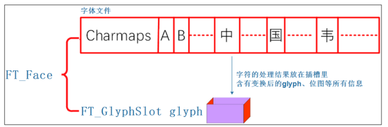

FreeType 是一个免费、开源、可移植且高质量的字体引擎，它有以下优点:

1. 支持多种字体格式文件，并提供了统一的访问接口；
1. 支持单色位图、反走样位图渲染，这使字体显示质量达到 Mac 的水平；
1. 采用面向对象思想设计，用户可以灵活的根据需要裁剪。
1. 无需预先生成字体的位图文件，提高了灵活性并减少了资源占用

只需要移植这个字体引擎，调用对应的 API 接口， 提供字体文件，就可以让 freetype 库帮我们取出关键点、实现闭合曲线, 填充颜色，达到显示矢量字体的目的.

LVGL 提供了 freetype 相关的接口函数, 需要在`lv_conf.h`中打开`LV_USE_FREETYPE`使能这些接口, **并保证在编译时同 freetype 库一同编译链接**.

# freetype 基础

## 文字显示过程

一个文字的显示过程可以概括如下:

1. 给定一个字符可以确定它的编码值(ASCII、UNICODE、GB2312)；
1. 设置字体大小；
1. 根据编码值，从文件头部中通过 charmap 找到对应的关键点(glyph)，它会根据字体大小调整关键点；
1. 把关键点转换为位图点阵；
1. 在 LCD 上显示出来

## 如何使用 freetype 库

1. 初始化: `FT_Init_Freetype`
1. 加载(打开)字体 Face: `FT_New_Face`
1. 设置字体大小: `FT_Set_Char_Sizes` 或 `FT_Set_Pixel_Sizes`
1. 根据编码类型选择 charmap: `FT_Select_Charmap`
1. 根据编码值找到字形图像
   1. 根据 charcode 找到 glyph_index: `glyph_index = FT_Get_Char_Index(face，charcode)`
   1. 根据 glyph_index 取出 glyph: `FT_Load_Glyph(face，glyph_index)`
1. 字形图像转为位图: `FT_Render_Glyph`
   1. 也可以使用`FT_Load_Char`代替上面的三步
1. 移动或旋转: `FT_Set_Transform`
1. 显示出来

## 重要的数据结构

- `FT_Library`: 对应 freetype 库
- `FT_Face`: 对应一个矢量字体文件
- `FT_GlyphSlot`: 用来保存字符的处理结果：比如转换后的 glyph、位图. 保存在`face->glyph`, 每次只能存储一个字形图像
  
  - 生成第 1 个字符位图时，它保存在 face->glyph 中
  - 生成第 2 个字符位图时，也会保存在 face->glyph 中，会覆盖第 1 个字符的位图
- `FT_Glyph`: 字体文件中保存有字符的原始关键点信息，使用 freetype 的函数可以放大、 缩小、旋转，这些新的关键点保存在插槽中
- `FT_BBox`: 表示一个字符的外框，即新 glyph 的外框

# LVGL 中使用 freetype 示例

## 相关宏定义

- `LV_FREETYPE_CACHE_SIZE`: 用于缓存字体位图、轮廓图、字符映射表等的最大内存（字节）。注意：此值不包括 FT_Face 和 FT_Size 对象使用的内存。
- `LV_FREETYPE_CACHE_FT_FACES`: 最大打开 FT_Face 对象数
- `LV_FREETYPE_CACHE_FT_SIZES`: 最大打开 FT_Size 对象数

## 初始化

```c
//在lv_vendor_start调用之前, 先完成字体的加载
ttf_init:
    //加载字体文件到psram中, psram保证渲染效率
    ret = _load_font_to_psram("/font/simhei_new.ttf", &g_PingFang_map, &g_PingFang_map_len);
        file_content = psram_malloc(file_len);//申请psram内存
        fd = open(font_name, O_RDONLY);
        read(fd, file_content, file_len);//将文件内容写入psram中
        close(fd);
    //填充lv_ft_info_t并进行初始化
    ft_info.name = "/font/simhei_new.ttf";
    ft_info.mem = g_PingFang_map;
    ft_info.mem_size = g_PingFang_map_len;
    lv_ft_font_init(&ft_info);//调用lvgl的font初始化函数
        return lv_ft_font_init_cache(info);
            //填充lv_font_fmt_ft_dsc_t
            dsc->mem = info->mem;
            dsc->mem_size = info->mem_size;
            //调用freetype函数
            //返回dec->font给lvgl
            info->font = font;
```

## 在 lvgl 中使用

```c
//在 lvgl 要显示文字时, 设置 style text font 为上面返回的 font 即可:
static lv_style_t style;
lv_style_init(&style);
lv_style_set_text_font(&style, LV_STATE_DEFAULT, ft_info.font);

/*Create a label with the new style*/
lv_obj_t * label = lv_label_create(lv_scr_act(), NULL);
lv_obj_add_style(label, LV_LABEL_PART_MAIN, &style);//方式1: 添加style
lv_label_set_text(label, "Hello world");
lv_obj_align(label, NULL, LV_ALIGN_IN_TOP_LEFT, 0, 0);

//方式2: 不使用lv_style_t, 直接设置label的text font属性
lv_obj_set_style_text_font(label, ft_info.font, LV_PART_MAIN | LV_STATE_DEFAULT);
```

# 字体库裁剪

ttf 字体库比较大, 会占用很大的内存空间, 因此可以对字体库进行裁剪, 删除不需要的字以减小体积.

```bash
pip install fonttools
# 裁剪成只包含在text.txt文件中的字符的字体
pyftsubset Input.ttf --text-file=text.txt  --output-file=Output.ttf

# 保留指定unicodes范围的字体
pyftsubset Input.ttf --output-file=Output.ttf --unicodes=U+0000-007F
```

# 常见问题

## 内存占用问题

在解析过程中，FreeType 会动态分配内存来存储字符图像，并在光栅化时将其转换为像素图像。这可能会导致内存占用问题，如内存泄漏或内存溢出。为了优化这一点，可以采用内存池技术，将字符图像分配到一个固定大小的内存池中，并在需要时从内存池中获取图像数据。
