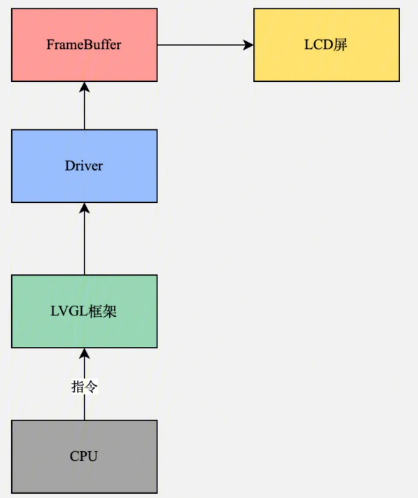

# 界面渲染原理



当应用程序需要显示图形界面时，LVGL 库会调用底层驱动程序来初始化 FrameBuffer 缓冲区，并将缓冲区中的图像信息传递给 LCD 屏进行显示。此时，CPU 会持续不断地将应用程序中的图形绘制指令传递给 LVGL 库，LVGL 库则将这些指令转换为对 FrameBuffer 缓冲区的操作，并通过底层驱动程序将操作传递给 LCD 屏进行显示。
LVGL 库还会通过底层驱动程序来监测设备上的事件，如按键事件、触摸事件等，并将事件信息传递给 LVGL 库中的事件处理函数进行处理。在事件处理函数中，LVGL 库会根据事件类型和事件发生的位置等信息来进行相应的操作，如改变窗口的位置、更新按钮的状态等。这些操作也是通过对 FrameBuffer 缓冲区的操作来实现的。

# 基本优化

## 帧率刷新周期

LVGL 是有一个帧率刷新周期的宏定义，在 lv_conf.h 里。LVGL 会通过 LVGL 内部的 tick，定时去刷屏幕，也就是说该宏定义限定了 LVGL 刷屏帧率的上限，默认满帧 33 帧:

```c
#define LV_DISP_DEF_REFR_PERIOD 30 /*[ms]*/
```

# 内存占用优化

1. 开启压缩模式：通过在配置中开启压缩模式，可以减少内存的使用
2. 减少字体文件的大小：可以使用更小的字体文件，或者通过减少字体文件中的字符来减小字体文件的大小。
3. 优化图像文件的大小：可以使用更小的图像文件，或者通过减少图像文件中的色彩深度来减小图像文件的大小。
4. 减少控件的数量：可以通过减少控件的数量来减小内存的使用。
5. 使用内存池：可以使用内存池来管理内存，这样可以避免反复申请和释放内存，从而减少内存的使用。
6. 关闭不必要的功能：可以关闭不必要的功能，如动画效果等，从而减少内存的使用。
7. 使用外部存储器：可以使用外部存储器来储存数据，从而减小内存的使用。
8. 使用裁剪功能, 只显示部分控件或图像，从而减小内存的使用
