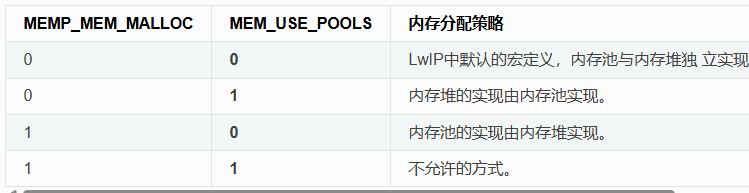
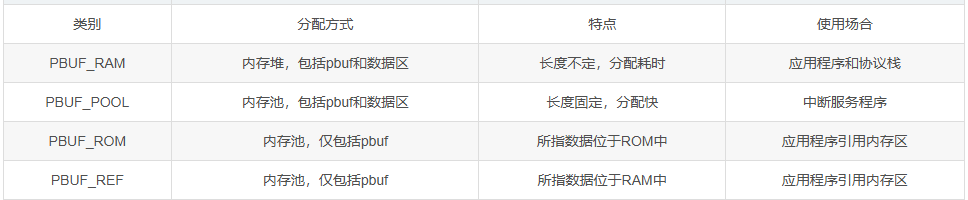
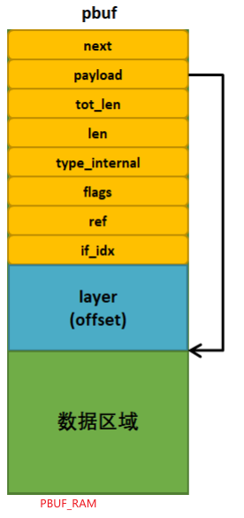
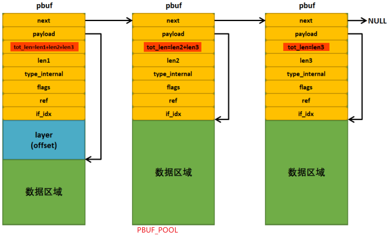
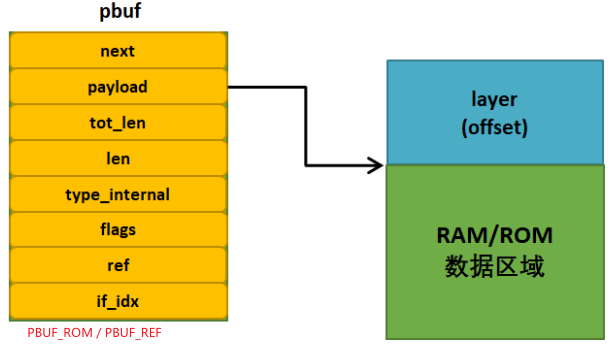

如果按照标准的 TCP/IP 协议栈这种严格的分层思想，在数据传输的时候就需要层层拷贝，因为各层之间的内存都不是共用的, 这样的效率时很慢的。
由于处理器的性能有限， LwIP 并没有采用很明确的分层结构，**LwIP 假设各层之间的资源都是共用的，各层之间的实现方式也是已知的**，这样的处理的方式就无需拷贝，各个层次之间存在交叉存取数据的现象，既节省系统的空间也节省处理的时间，而且更加灵活。

# 内存管理

可以通过如下配置设置使用哪种内存管理方式:

- MEM_LIBC_MALLOC: 是否使用 C 标准库自带的内存分配策略, 使用系统内存
- MEMP_MEM_MALLOC: 是否使用 LwIP 内存堆 heap 分配策略实现内存池分配. 默认情况下为 0，表示不从内存堆中分配，内存池为独立一块内存实现
  - 即**要从内存池中获取内存时，实际是从内存堆中分配**
  - 使用 LWIP 自带的 mem_malloc、mem_free 等函数
- MEM_USE_POOLS: 表示是否使用 LwIP 内存池分配策略实现内存堆的分配. 默认情况下为 0，表示不使用从内存池中分配，内存堆为独立一块内存实现
  - 要从内存堆中获取内存时，实际是从内存池中分配
  - 使用 LWIP 自带的 mem_malloc、mem_free 等函数



## heap

LwIP 通过 Heap 的方式可分配的总内存空间大小由`MEM_SIZE`定义，如果应用程序需要发送大量数据，而且这些数据需要拷贝到 LwIP 协议栈中，那么这个值尽量设置大些。

heap 其实是用下面的宏定义了一个数组当作动态内存申请:

```c
#define MEM_SIZE_ALIGNED     LWIP_MEM_ALIGN_SIZE(MEM_SIZE)

#ifndef LWIP_RAM_HEAP_POINTER
/** the heap. we need one struct mem at the end and some room for alignment */
LWIP_DECLARE_MEMORY_ALIGNED(ram_heap, MEM_SIZE_ALIGNED + (2U * SIZEOF_STRUCT_MEM));
#define LWIP_RAM_HEAP_POINTER ram_heap
#endif /* LWIP_RAM_HEAP_POINTER */

//最终是一个指定大小的u8数组, 名称为ram_heap
#define LWIP_DECLARE_MEMORY_ALIGNED(variable_name, size) u8_t variable_name[LWIP_MEM_ALIGN_BUFFER(size)]
```

> 实际编译后**会不会影响系统可用内存要看 lds 文件中对这部分 bss 数据指定的位置(包括下面的内存池, 一个原理)**. 曾经遇到修改了 heap 和 pool 的大小但系统内存病没有变化, 最后发现这两部分在 lds 文件中并没有定义在 ram 中, 所以大小改变无法影响 ram 的空闲大小.

## pool

内存配置是通过下面的宏定义，生成一个个内存池类型对应的`memp_desc`结构体, 保存在`memp_pools`中的.

> 真正的内存池区域，使用`u8_t memp_memory_XXXX_base`进行定义，XXXX 表示对应的 POOL 类型，每个类型都有自己的内存池区域，是编译时开辟出来的内存空间，简单来说就是一个数组，我们知道这个区域的的起始地址，就能对它进行操作

```c
//使用的宏
#define LWIP_MALLOC_MEMPOOL(num, size) LWIP_MEMPOOL(POOL_##size, num, (size + LWIP_MEM_ALIGN_SIZE(sizeof(struct memp_malloc_helper))), "MALLOC_"#size)

#define LWIP_MEMPOOL(name,num,size,desc) LWIP_MEMPOOL_DECLARE(name,num,size,desc)
#include "lwip/priv/memp_std.h"

#define LWIP_MEMPOOL_DECLARE(name,num,size,desc) \
  LWIP_DECLARE_MEMORY_ALIGNED(memp_memory_ ## name ## _base, ((num) * (MEMP_SIZE + MEMP_ALIGN_SIZE(size))));

//最终是一个指定大小的u8数组, 名称为memp_memory_XXXX_base
#define LWIP_DECLARE_MEMORY_ALIGNED(variable_name, size) u8_t variable_name[LWIP_MEM_ALIGN_BUFFER(size)]


const struct memp_desc* const memp_pools[MEMP_MAX] = {
#define LWIP_MEMPOOL(name,num,size,desc) &memp_ ## name,
#include "lwip/priv/memp_std.h"
};

//lwip默认给各类结构分配的内存池, 比如TCP
#if LWIP_TCP
LWIP_MEMPOOL(TCP_PCB,        MEMP_NUM_TCP_PCB,         sizeof(struct tcp_pcb),        "TCP_PCB")
LWIP_MEMPOOL(TCP_PCB_LISTEN, MEMP_NUM_TCP_PCB_LISTEN,  sizeof(struct tcp_pcb_listen), "TCP_PCB_LISTEN")
LWIP_MEMPOOL(TCP_SEG,        MEMP_NUM_TCP_SEG,         sizeof(struct tcp_seg),        "TCP_SEG")
#endif /* LWIP_TCP */

//自定义的内存池大小和数量
LWIP_MALLOC_MEMPOOL_START
LWIP_MALLOC_MEMPOOL(20, 256)
LWIP_MALLOC_MEMPOOL(10, 512)
LWIP_MALLOC_MEMPOOL(5, 1512)
LWIP_MALLOC_MEMPOOL_END
```

# 内存配置

## pbuf

- MEMP_NUM_PBUF： 定义可以创建用于 PBUF_ROM & PBUF_REF 的 PBUF 的个数. 即包含 pbuf 结构体，不携带数据的情况
- PBUF_POOL_SIZE: 定义可用的 PBUF_POOL 的个数
- PBUF_POOL_BUFSIZE: 定义每个 PBUF_POOL 的大小

> `PBUF_POOL_SIZE * PBUF_POOL_BUFSIZE`的值就是接收数据内存总的大小。用户需要根据接收的数据包的平均大小来设置这两个值。PBUF_POOL_BUFSIZE 设置的太小，可能每个数据包都要多个 pbuf 来保存；设置太大，很少的数据也会占用一个较大的 pbuf 造成浪费。

## 网络连接个数

LwIP 协议栈中通过 PCB（Protocol Control Blocks）的方式管理各个连接。创建新的 PCB 时，也是通过 memory pool 的方式进行内存分配

- MEMP_NUM_RAW_PCB： 定义可以创建的 RAW 连接个数
- MEMP_NUM_UDP_PCB: 定义可以创建的 UDP 连接个数
- MEMP_NUM_TCP_PCB: 定义可以创建的 TCP 连接个数
- MEMP_NUM_TCP_PCB_LISTEN: 可以创建 listening TCP 连接的个数
- MEMP_NUM_NETCONN: 使用 netconn 和 socket 编程时，该值的大小会影响可以同时创建的连接的个数
- MEMP_NUM_NETBUF: 使用 netconn 和 socket 编程时，该值设置太小，可能导致接收数据时分配内存失败，从而不能同时为几个连接的数据收发服务

## tcp 选项

- TCP_MSS: 该值规定了 TCP 数据包数据部分的最大长度
- TCP_SND_BUF: 一个 TCP 连接的发送缓存空间大小。**改变这个值只影响一个 TCP 连接可用的发送缓存空间大小**。总的发送缓存空间是不会变的（由 MEM_SIZE 决定）。如果同时活动的 TCP 连接个数很多，这个值不宜设置的太大。
- TCP_SND_QUEUELEN: TCP 发送队列中最多的 pbuf 个数, **决定了在未发送或未确认的队列中的 pbufs 的总数**
- TCP_WND: TCP 接收窗口大小

# struct pbuf

pbuf 是描述数据报文的结构， 用于在 lwip 各个模块和各层之间传输报文，统一的结构便于封装和拆解。
基本属性如下:

```c
struct pbuf {
    struct pbuf *next; //可能需要多个pbuf保存一个完整的报文, 所以需要pbuf链表
    void *payload; //指向报文数据区域
    u16_t tot_len;//本pbuf数据长度 + pbuf链表后续所有pbuf的数据长度
    u16_t len;    //本pbuf数据长度
    u8_t type_internal; //pbuf的类型
    LWIP_PBUF_REF_T ref;//本pbuf被引用了多少次, 用于释放时判断?
    u8_t if_idx; //用于收到的报文, 表示属于哪个netif网卡
};
```

## pbuf 类型

上面结构体中有一个属性是 pbuf 的类型, pbuf 共有 4 种类型:


- PBUF_RAM: 空间通过**heap**分配, 从内存中之间 malloc,或从 lwip 管理的 heap 空间 malloc
  
- PBUF_POOL: 空间通过**MEMP_PBUF_POOL 内存池**分配, 从内存池分配适当的内存块个数以满足申请的空间大小
  
- PBUF_ROM & PBUF_REF: **只包含 pbuf 结构体, 不包含数据区域**. 空间通过**MEMP_PBUF 内存池**分配
  

## pbuf layer

在调用`pbuf_alloc`申请 pbuf 时, 指定不同的协议层次就可以申请出足够的空间, 并且预留出对应的协议 header 部分.
比如下面调用:

```c
p = pbuf_alloc(PBUF_TRANSPORT, 512, PBUF_RAM);
```

实际申请的长度是: `pbuf 结构体长度+传输层 header 长度+ip 层 header 长度+链路层以太网 header 长度+512`

# pbuf 操作函数

- pbuf_alloc: 根据 pbuf type 和 pbuf layer 申请内存
- pbuf_free: 释放 pbuf 内存. 当引用为 0 时释放; **对应 pbuf 链表, 只能传入 header, 不能传入中间节点**
- pbuf_realloc: 释放尾部多余的空间
- pbuf_header: 使 payload 指针指向 layer header 区域

# lwipopt.h 文件配置参数

```c
//内存堆heap大小
 #define MEM_SIZE                (25*1024)

 /* memp结构的pbuf数量,如果应用从ROM或者静态存储区发送大量数据时这个值应该设置大一点 */
 #define MEMP_NUM_PBUF           25

 /* 最多同时在TCP缓冲队列中的报文段数量 */
 #define MEMP_NUM_TCP_SEG        150

 /* 内存池大小 */
 #define PBUF_POOL_SIZE          65

 /* 每个pbuf内存池大小 */
 #define PBUF_POOL_BUFSIZE       LWIP_MEM_ALIGN_SIZE(TCP_MSS+40+PBUF_LINK_ENCAPSULATION_HLEN+PBUF_LINK_HLEN)

 /* 最大TCP报文段，TCP_MSS = (MTU - IP报头大小 - TCP报头大小 */
 #define TCP_MSS                 (1500 - 40)

 /* TCP发送缓冲区大小（字节） */
 #define TCP_SND_BUF             (11*TCP_MSS)

 /*  TCP发送缓冲区队列的最大长度 */
 #define TCP_SND_QUEUELEN        (8* TCP_SND_BUF/TCP_MSS)

 /* TCP接收窗口大小 */
 #define TCP_WND                 (11*TCP_MSS)
```
