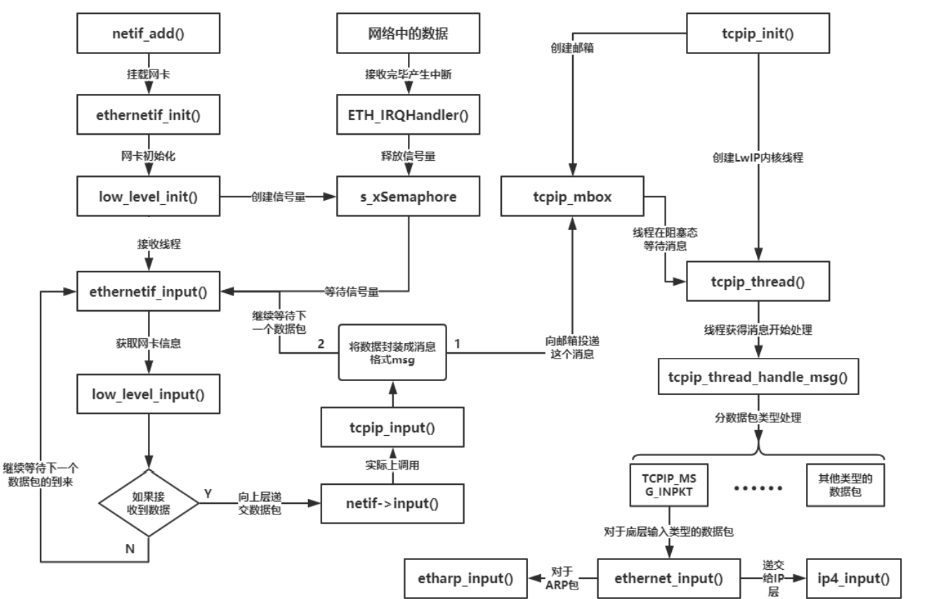
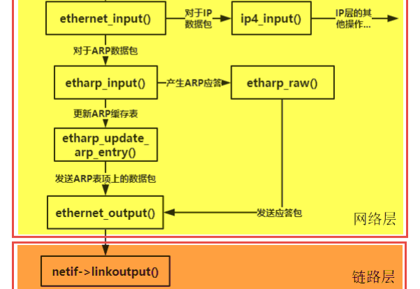
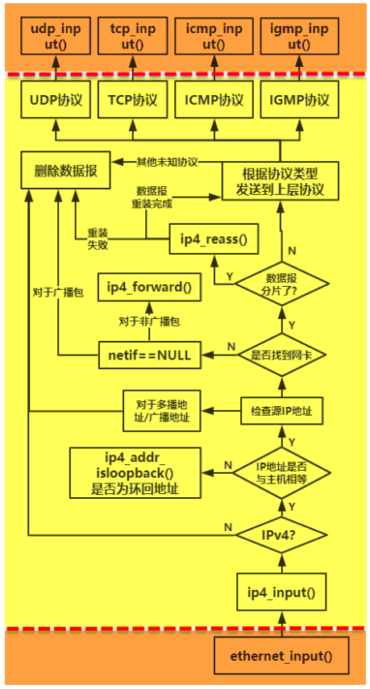
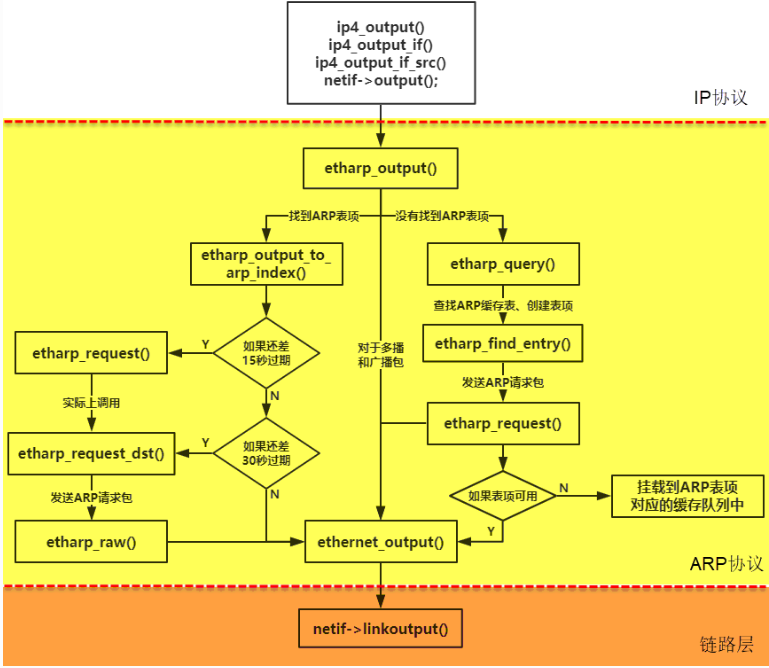

# 数据接收流程

## 基本步骤

1. 板卡上 eth 接收完数据后产生一个中断，中断处理函数释放一个信号量通知网卡接收线程
1. 网卡接收线程主动调用`ethernetif_input`去获取要接收的数据，然后将数据这些数据封装成消息，投递到 tcpip_mbox 邮箱中.
1. LwIP 内核线程得到这个消息，就对消息进行解析，根据消息中数据包类型进行处理
1. 调用`ethernet_input`决定是否递交到 ip 层还是 arp 层
   1. 如果是 ARP 数据包就会给 ARP 层 去处理, 更新 ARP 缓存表
   1. 如果是 IP 数据报就使用 ip4_input()函数继续处理. ip 层会继续解析报文, 并进一步去除 ip header, 交给更上层的 tcp/udp/icmp/igmp 层继续处理.



## ethernetif_input

对应的代码流程：

```c
//中断处理调用, 或有个单独线程等待信号量调用
//contrib/examples/ethernetif/ethernetif.c, 仅为示例, 具体实现会有逻辑差别
ethernetif_input:
    p = low_level_input(netif);//通过底层函数从网卡获取报文, 并返回pbuf格式
    if (p != NULL)
        netif->input(p, netif);//调用网卡的input函数
            //input时在netif_add时设置的, 一般为tcpip_input

//调用input对应函数
tcpip_input:
    return tcpip_inpkt(p, inp, ethernet_input);
        //如果没有tcpip 线程, 直接在这里调用ethernet_input处理报文
        //如果有tcpip 线程, 发送消息到tcpip线程, 再调用ethernet_input处理报文
        msg->type = TCPIP_MSG_INPKT;
        msg->msg.inp.input_fn = input_fn;
        sys_mbox_trypost(&tcpip_mbox, msg);
```

## ethernet_input

```c
//tcpip thread主循环
tcpip_thread:
    while (1)
        TCPIP_MBOX_FETCH(&tcpip_mbox, (void **)&msg);//等待mbox消息, 并在等待时处理超时
        tcpip_thread_handle_msg(msg);
            case TCPIP_MSG_INPKT://调用发消息前设置的处理函数
                msg->msg.inp.input_fn(msg->msg.inp.p, msg->msg.inp.netif);

//调用收到报文处理函数
ethernet_input:
    ethhdr = (struct eth_hdr *)p->payload;//获取以太网header
    type = ethhdr->type;//取出类型, 根据类型进行不同处理
    switch (type)
        case PP_HTONS(ETHTYPE_IP)://ip报文
            pbuf_remove_header(p, next_hdr_offset);//去除链路层header
            ip4_input(p, netif);//交给ip层处理header去除后的报文, ip header为首部的报文

        case PP_HTONS(ETHTYPE_ARP)://arp报文
            pbuf_remove_header(p, next_hdr_offset);//去除链路层header
            etharp_input(p, netif);//交给arp层处理报文
        //还有其他pppoe, ipv6的case
```

## arp 报文处理



```c
etharp_input:
    hdr = (struct etharp_hdr *)p->payload;//获取arp header
    //更新arp缓存
    etharp_update_arp_entry(netif, &sipaddr, &(hdr->shwaddr)...);
        //查找arp entry, 没有就创建新的缓存项
        i = etharp_find_entry(ipaddr, flags, netif);
        //设置表项状态为stable
        arp_table[i].state = ETHARP_STATE_STABLE;
        //更新MAC地址
        SMEMCPY(&arp_table[i].ethaddr, ethaddr, ETH_HWADDR_LEN);
        arp_table[i].ctime = 0;//重置存活时间
        //如果支持arp缓存队列, 遍历arp_table[i].q, 发送每个缓存的报文
        //如果不支持arp缓存队列, 只发送arp_table[i].q
        ethernet_output(netif, p, (struct eth_addr *)(netif->hwaddr), ethaddr, ETHTYPE_IP);

    //处理arp msg
    switch (hdr->opcode)
        case PP_HTONS(ARP_REQUEST):
            //回复arp reply, 携带本网卡的MAC和ip
            etharp_raw(netif,...netif->hwaddr, netif_ip4_addr(netif)...);
        case PP_HTONS(ARP_REPLY):
            //不需要处理, 前面已经更新了arp缓存
```

## ip 报文处理



```c
ip4_input:
    if (IPH_V(iphdr) != 4)
        //如果不是ipv4， 返回
    //获取ip header长度
    iphdr_hlen = IPH_HL_BYTES(iphdr);
    //获取报文总长度
    iphdr_len = lwip_ntohs(IPH_LEN(iphdr));
    if ((iphdr_hlen > p->len) || (iphdr_len > p->tot_len) || (iphdr_hlen < IP_HLEN))
        //header长度超过第一个 pbuf 长度，或者 ip 长度超过总 pbuf 长度， 返回
    //检查报文的src和dest地址，判断报文是不是发给指定网卡的
    if (netif == NULL)
        //报文不是发给我们的网卡的，根据宏定义IP_FORWARD决定转发或丢弃

    //根据传输层协议的不同, 调用不同函数继续处理
    switch (IPH_PROTO(iphdr))
        case IP_PROTO_UDP:
        case IP_PROTO_UDPLITE:
            udp_input(p, inp);
        case IP_PROTO_TCP:
            tcp_input(p, inp);
        case IP_PROTO_ICMP:
            icmp_input(p, inp);
        case IP_PROTO_IGMP:
            igmp_input(p, inp, ip4_current_dest_addr());
        default：
            //对于单播， 回复目标不可达的ICMP
            if (!ip4_addr_isbroadcast(ip4_current_dest_addr(), netif)...)
                icmp_dest_unreach(p, ICMP_DUR_PROTO);
```

后续每个协议的处理过程不在这个列出, 后续研究单个协议时在其他章节补充后续流程.

# 数据发送流程

## ip/arp 层基本步骤

如果上层协议想要发送数据，需要经过 ARP 协议将 IP 地址映射为 MAC 地址才能完成发送操作，上层协议需要用**ip4_output_if_opt_src 函数**发送报文, 然后通过下面方式发送给 arp 层:

- 报文较小, 可以依次发送, 调用`netif->output`函数, 该函数在 netif_add 中调用 init 时设置, 一般为`etharp_output`
- 报文较大, 需要分片处理, 调用`ip4_frag`分成多片, 每片数据调用`netif->output`函数

ARP 层通过 **etharp_output 函数**接收到 IP 数据报后，会先从数据包中进行分析，看看这个 IP 数据报是单播数据包还是多播或者是广播数据包，然后进行不同的处理：

- 对于多播或者广播，不需要特定的 MAC 地址, 直接将数据包丢给网卡就行了（调用**ethernet_output 函数**）。
- 对于单播包，ARP 协议需要根据 IP 地址找到对应的 MAC 地址，才能正确发送.
- 如果找不到 MAC 地址的话，就要延迟发送数据包，先通过 ARP 协议找到 MAC 地址
  - ARP 协议会创建一个 ARP 表项， 然后将数据包*复制后*挂到 ARP 表项对应的缓存队列上
  - 发出一个 ARP 请求包，等待目标主机的回应后再发送 IP 数据报。



## ip 层发送流程

以基本的 udp 和 tcp 为例, 研究 ip 层的处理过程.

- udp: 调用`udp_sendto`发送 udp 报文, 最终会调用 ip 层函数`ip4_output_if_opt_src`
- tcp: 调用`tcp_output`发送 tcp 报文, 最终会调用 ip 层函数`ip4_output_if_opt_src`

### 直接发送

```c
ip4_output_if_opt_src:
    //判断是否填充了ip header
    if (dest != LWIP_IP_HDRINCL)
        pbuf_add_header(p, IP_HLEN);//添加ip header
        iphdr = (struct ip_hdr *)p->payload;
        //填充iphdr内容
        ip4_addr_copy(iphdr->dest, *dest);//目标ip地址
        IPH_LEN_SET(iphdr, lwip_htons(p->tot_len));//报文总长度
        ip4_addr_copy(iphdr->src, *src);//源ip地址
    else
        //已经有ip header, 从中获取dest addr

    //判断是不是loop test, 自己发给自己的报文
    if (ip4_addr_cmp(dest, netif_ip4_addr(netif)))
        return netif_loop_output(netif, p);
    //如果报文长度大于网卡的MTU, 需要分片发送
    if (netif->mtu && (p->tot_len > netif->mtu))
        return ip4_frag(p, netif, dest); //报文分片，发送
    //其他情况, 直接发送
    return netif->output(netif, p, dest);
```

### ip 报文分片

```c
ip4_frag:
    if (IPH_HL_BYTES(iphdr) != IP_HLEN)
        return ERR_VAL;//分片不支持携带ip options
    //计算要发送的payload长度
    left = (u16_t)(p->tot_len - IP_HLEN);
    while (left)
        fragsize = LWIP_MIN(left, (u16_t)(nfb * 8));//计算分片大小
        rambuf = pbuf_alloc(PBUF_LINK, IP_HLEN, PBUF_RAM);//申请分片 header的内存
        SMEMCPY(rambuf->payload, original_iphdr, IP_HLEN);//复制原始数据的ip header
        left_to_copy = fragsize;
        while (left_to_copy)
            pcr = ip_frag_alloc_pbuf_custom_ref();//申请分片的pbuf, 可能有多个
            //初始化分片
            newpbuf = pbuf_alloced_custom(PBUF_RAW, newpbuflen, PBUF_REF, &pcr->pc...);
            pbuf_cat(rambuf, newpbuf);//添加到ip header的末尾
            //更新本分片剩下需要发送的数据长度
            left_to_copy = (u16_t)(left_to_copy - newpbuflen);
        //更新报文的偏移量
        poff = (u16_t)(poff + newpbuflen);
        //设置分片相关的属性
        //调用网卡函数发送
        netif->output(netif, rambuf, dest);
        //更新待发送的数据长度
        left = (u16_t)(left - fragsize);
```

## arp 层发送流程

### arp 入口

ip 层调用的`netif->output`即为`etharp_output`函数, 从此函数开始就进入了 arp 层的处理

```c
etharp_output:
    //获取dest地址
    //广播和多播保存到dest
    //单播从ip header获取ip地址, 保存到dst_addr
    struct ip_hdr *iphdr = LWIP_ALIGNMENT_CAST(struct ip_hdr *, q->payload);
    dst_addr = LWIP_HOOK_ETHARP_GET_GW(netif, ipaddr);

    //对于单播, 需要查arp_table,
    for (i = 0; i < ARP_TABLE_SIZE; i++)
        if (... && (ip4_addr_cmp(dst_addr, &arp_table[i].ipaddr))
            //找到arp entry
            return etharp_output_to_arp_index(netif, q, i);
    //找不到arp entry, 需要开启查询
    return etharp_query(netif, dst_addr, q);
    //对于广播和多播, 直接发送
    return ethernet_output(netif, q, (struct eth_addr *)(netif->hwaddr), dest, ETHTYPE_IP);
        return netif->linkoutput(netif, p);//调用网卡发送函数low_level_output
```

### 单播找到 arp

找到 arp entry, 取出 entry 中保存的 MAC 地址之后就可以发送

```c
etharp_output_to_arp_index:
    //arp entry是有效的, 如果快要过期了, 就主动发起新的arp请求, 但不影响本次报文发送.
    if (arp_table[arp_idx].state == ETHARP_STATE_STABLE)
        if (arp_table[arp_idx].ctime >= ARP_AGE_REREQUEST_USED_BROADCAST)//还有15秒过期
            etharp_request(netif, &arp_table[arp_idx].ipaddr);
                //发送的arp广播
        else if (arp_table[arp_idx].ctime >= ARP_AGE_REREQUEST_USED_UNICAST)//还有30秒过期
            etharp_request_dst(netif, &arp_table[arp_idx].ipaddr, &arp_table[arp_idx].ethaddr);
                //发送的arp单播, 直接发给对应MAC的设备, 反正不成功还可以在15秒时发广播
    //用arp entry的MAC地址发送
    return ethernet_output(netif, q, (struct eth_addr *)(netif->hwaddr), &arp_table[arp_idx].ethaddr, ETHTYPE_IP);
```

### 单播未找到 arp

对于没找到 arp entry 的情况, 就需要发起一个标准的 arp 广播, 查找 ip 对应的 MAC

```c
etharp_query:
    //判断时广播或多播地址, 返回
    //查找arp table是否有过期的arp entry, 没有则创建新的, 返回index
    i_err = etharp_find_entry(ipaddr, ETHARP_FLAG_TRY_HARD, netif);
        for (i = 0; i < ARP_TABLE_SIZE; ++i)
            if (ipaddr && ip4_addr_cmp(ipaddr, &arp_table[i].ipaddr)...)
                //ip相同, 属于同一个netif, 则可以返回index
                return i;
        //没有匹配的, 选择新的index, 填充entry并返回index
        ip4_addr_copy(arp_table[i].ipaddr, *ipaddr);
        arp_table[i].netif = netif;
        return (s16_t)i;

    arp_table[i].state = ETHARP_STATE_PENDING;//设置状态为pending
    if (is_new_entry || (q == NULL))
        result = etharp_request(netif, ipaddr);//发送ARP请求

    //arp entry可用, 直接发送
    if (arp_table[i].state >= ETHARP_STATE_STABLE)
        //此场景为, 之前发出过arp请求, 在本函数处理期间arp entry更新了, 那就不用等了
        result = ethernet_output(netif, q, srcaddr, &(arp_table[i].ethaddr), ETHTYPE_IP);
    else if (arp_table[i].state == ETHARP_STATE_PENDING)
        //实际应该只会走这里, 刚发出的arp广播, 不会那么快收到回复
        p = pbuf_clone(PBUF_LINK, PBUF_RAM, q);//复制要发送的数据
        if (p != NULL)
            #if ARP_QUEUEING //如果支持arp缓存队列, 就申请arp queue entry, 把复制的数据添加到缓存队列
                new_entry = (struct etharp_q_entry *)memp_malloc(MEMP_ARP_QUEUE);
                    if (new_entry != NULL)
                        new_entry->p = p;
                        arp_table[i].q = new_entry;
            #else //如果不支持缓存队列, 就只保存当前要发送的一个报文
                arp_table[i].q = p;
```
