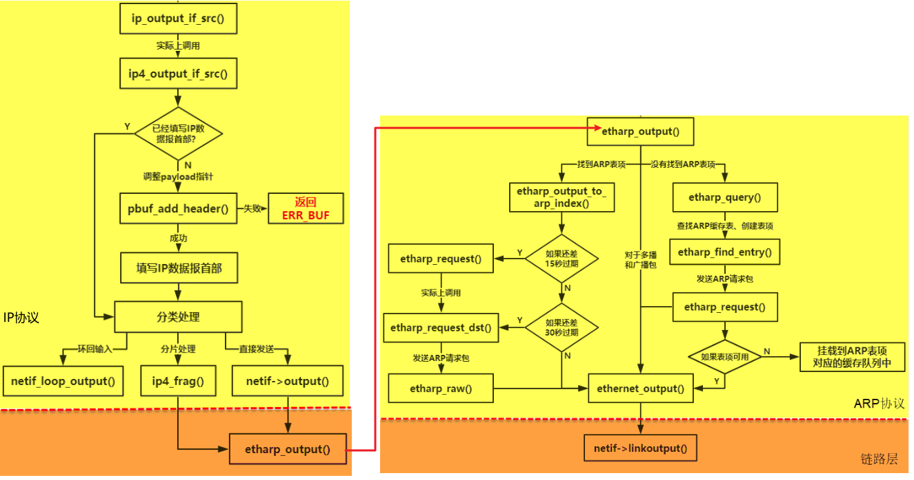

# 数据接收流程

1. 板卡上 eth 接收完数据后产生一个中断，中断处理函数释放一个信号量通知网卡接收线程
1. 网卡接收线程主动调用`ethernetif_input`去获取要接收的数据，然后将数据这些数据封装成消息，投递到 tcpip_mbox 邮箱中.
1. LwIP 内核线程得到这个消息，就对消息进行解析，根据消息中数据包类型进行处理
1. 调用`ethernet_input`决定是否递交到 ip 层还是 arp 层
   1. 如果是 ARP 数据包就会给 ARP 层 去处理, 更新 ARP 缓存表
   1. 如果是 IP 数据报就使用 ip4_input()函数传递到上层.

# 数据包发送流程

如果上层协议想要发送数据，也需要经过 ARP 协议将 IP 地址映射为 MAC 地址才能完成发送操作，IP 数据报通过 ip4_output 函数将上层数据包传递到 ARP 层处理.
ARP 层通过 **etharp_output 函数**接收到 IP 数据报后，会先从数据包中进行分析，看看这个 IP 数据报是单播数据包还是多播或者是广播数据包，然后进行不同的处理：

- 对于多播或者是广播数据包，直接将数据包丢给网卡就行了（调用**ethernet_output 函数**）。
- 对于单播包，ARP 协议需要根据 IP 地址找到对应的 MAC 地址，然后才能正确发送.
- 如果找不到 MAC 地址的话，还要延迟发送数据包，先通过 ARP 报文找到 MAC 地址
  - ARP 协议首先会创建一个 ARP 表项， 然后将数据包挂到 ARP 表项对应的缓存队列上
  - 会发出一个 ARP 请求包，等待目标主机的回应后再发送 IP 数据报。

