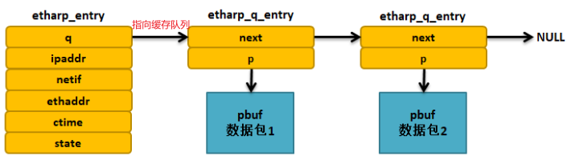
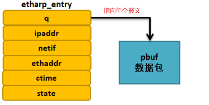

ARP 协议的核心是 ARP 缓存表， ARP 的实质就是对缓存表的建立、更新、查询等操作.

# etharp_entry

LwIP 使用一个 `arp_table` 数组描述 ARP 缓存表，数组保存的是 arp 表项`etharp_entry`。每个表项都必须记录一对 IP 地址与 MAC 地址的映射关系，此外还有一些基本的信息，如表项的状态、生命周期（生存时间）以及对应网卡的基本信息:

```c
struct etharp_entry {
#if ARP_QUEUEING
  struct etharp_q_entry *q;  //指向此 ARP 表项上缓存数据包队列的指针
#else /* ARP_QUEUEING */
  struct pbuf *q;           //指向此 ARP 表项上的单个缓存数据包的指针
#endif /* ARP_QUEUEING */
  ip4_addr_t ipaddr;        //目标ip地址
  struct netif *netif;      //网卡信息, 该arp表项属于哪个网卡
  struct eth_addr ethaddr;  //MAC地址
  u16_t ctime;              //存活时间
  u8_t state;
};
```

## arp 缓存队列

如果缓存表里没有表项, 那要发送的报文就需要先放到 etharp_entry 下的缓存中, 等协议栈发出 arp 请求并得到回复之后, 才能继续发送.
根据 ARP_QUEUEING 的配置, 有以下两种方式保存要发生的报文:

- 有缓存队列
  
- 无缓存队列
  

## arp state

- `ETHARP_STATE_EMPTY`: arp 缓存表在初始化的时候，所有的表项都会被初始化为`ETHARP_STATE_EMPTY`，也就是空状态，表示这些表项能被使用.
- `ETHARP_STATE_PENDING`: 已经发出 arp 请求, 还未收到回复(等到有超时时间)
- `ETHARP_STATE_STABLE`: 已经收到 arp 回复, 并且更新了缓存, 缓存在存活时间内
- `ETHARP_STATE_STABLE_REREQUESTING_1`: 处于 stable 状态的表项临近失效(距离失效 30 或 15 秒), 再次发出 arp 请求时
- `ETHARP_STATE_STABLE_REREQUESTING_2`: `etharp_tmr`周期检测缓存表项时, requesting_1 的会被修改为本状态

# arp 请求流程

arp 发送请求和处理回复都在 4_data_inout.md 数据收发流程中总结了, 不再赘述.

# arp 缓存超时处理

`etharp_tmr`是 lwip 初始化时启动的周期性 timer, 用于检查 arp 缓存是否失效, 周期为 ARP_TMR_INTERVAL(1 秒).

```c
etharp_tmr:
    //遍历arp_table, 删除过期的表项
    for (i = 0; i < ARP_TABLE_SIZE; ++i)
        arp_table[i].ctime++; //增加表项的时间
        //判断时间是否超过存活时间, 或处于pending状态的表项是否超过peingding时间
        if ((arp_table[i].ctime >= ARP_MAXAGE)...)
            etharp_free_entry(i);//清除该表项
                arp_table[i].state = ETHARP_STATE_EMPTY;//恢复初始状态, 并清空各个属性
        //pending状态, 重发arp请求
        else if (arp_table[i].state == ETHARP_STATE_PENDING)
            etharp_request(arp_table[i].netif, &arp_table[i].ipaddr);
        //requesti_1和requesti_1状态下的表项, 更新状态
```
