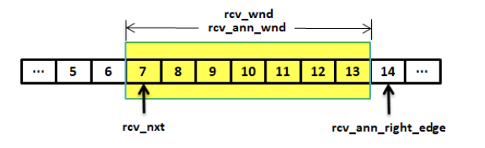
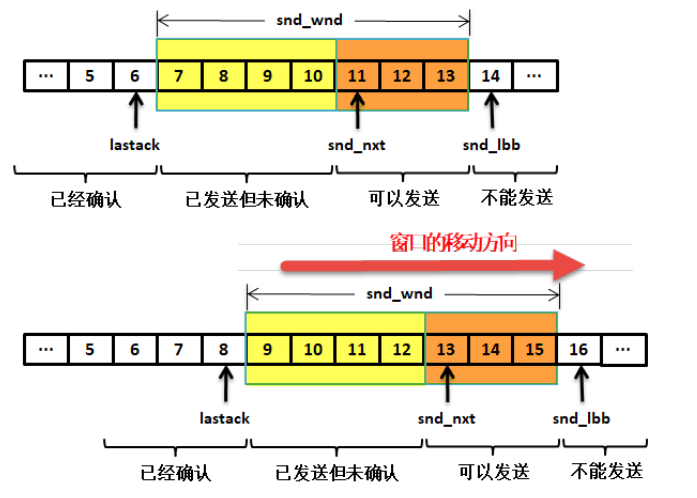
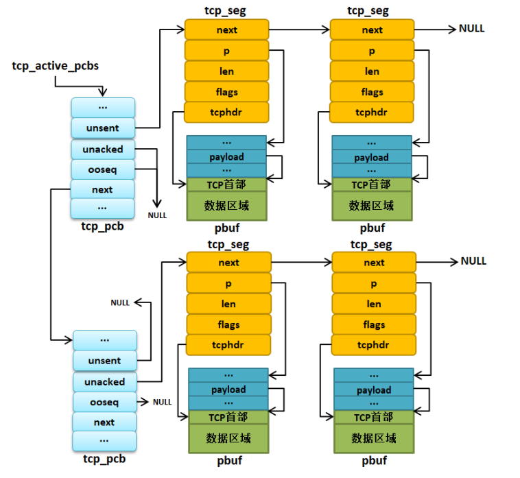
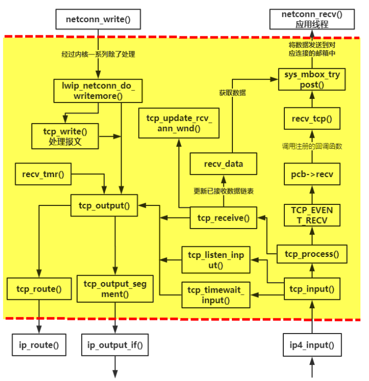

# 数据结构

## tcp_hdr

LwIP 中，报文段首部采用一个名字叫`tcp_hdr`的结构体进行描述:

```c
struct tcp_hdr
{
    PACK_STRUCT_FIELD(u16_t src); /* 源端口 */
    PACK_STRUCT_FIELD(u16_t dest); /* 目标端口 */
    PACK_STRUCT_FIELD(u32_t seqno); /* 序号 */
    PACK_STRUCT_FIELD(u32_t ackno); /* 确认序号 */
    PACK_STRUCT_FIELD(u16_t _hdrlen_rsvd_flags); /* 首部长度 + 保留位 + 标志位 */
    PACK_STRUCT_FIELD(u16_t wnd); /* 窗口大小 */
    PACK_STRUCT_FIELD(u16_t chksum); /* 校验和 */
    PACK_STRUCT_FIELD(u16_t urgp); /* 紧急指针 */
} PACK_STRUCT_STRUCT;
```

## tcp pcb

为了描述 TCP 协议， LwIP 定义了一个名字叫`tcp_pcb`的结构体，我们称之为**TCP 控制块**，其内定义了大量的成员变量，基本定义了整个 TCP 协议运作过程的所有需要的东西.
除了定义了一个完整的 TCP 控制块之外，还定义了一个简化版的 TCP 控制块`tcp_pcb_listen`，用于**描述处于监听状态的连接**，因为分配完整的 TCP 控制块是比较消耗内存资源的，而 TCP 协议在连接之前，是无法进行数据传输的，那么在监听的时候只需要把对方主机的相关信息得到，然后无缝切换到完整的 TCP 控制块中，这样子就能节省不少资源.

### tcp pcb 链表

lwip 中有四个控制块链表, 用于保存不同状态的 tcp 连接:

```c
struct tcp_pcb *tcp_bound_pcbs; //新绑定的端口, closed状态
union tcp_listen_pcbs_t tcp_listen_pcbs; //处于监听状态的 TCP 控制块
struct tcp_pcb *tcp_active_pcbs; //处于活跃状态的控制块, 可以进行状态转移
struct tcp_pcb *tcp_tw_pcbs; //处于 TIME_WAIT 状态的控制块
```

Note: **`tcp_debug_print_pcbs`可以用于打印上面几类 pcb 的信息和使用的端口**。

### 接收窗口

在`tcp_pcb`中有以下几个变量用于定义接收窗口:


- `rcv_nxt` 表示下次期望接收到的数据编号
- `rcv_wnd` 表示接收窗口的大小
- `rcv_ann_wnd` 用于告诉发送方窗口的大小
- `rcv_ann_right_edge` 记录了窗口的右边界

### 发送窗口

在`tcp_pcb`中有以下几个变量用于定义接收窗口:


- `lastack` 记录了已经确认的最大序号
- `snd_nxt` 表示下次要发送的序号
- `snd_lbb` 是表示下一个将被应用线程缓存的序号
- `snd_wnd` 表示发送窗口的大小，是由接收已方提供的

### 缓存队列指针

TCP 控制块只是维护缓冲区队列的指针，通过指针简单对这些缓冲区进行管理.

- `unsent` 指向未发送的报文段缓冲队列
- `unacked` 指向已发送但未收到确认的报文段缓冲队列
- `ooseq` 指向已经收到的无序报文段缓冲队列

## tcp_seg

lwip 特地定义了一个数据结构，命名为`tcp_seg`，使用它将所有的报文段连接起来，这些报文可能是无发送的、可能是已发送但未确认的或者是已经接收到的无序报文. 通过`tcp_pcb`中的缓存队列指针进行访问.

```c
struct tcp_seg
{
    struct tcp_seg *next; /* 指向下一个 tcp_seg */
    struct pbuf *p; /* 指向报文段的 pbuf */
    u16_t len; /* 报文段的数据长度 */
    u8_t flags; /* 报文段标志属性 */
    struct tcp_hdr *tcphdr; /* 指向报文段首部 */
};
```



# tcp 数据收发



## 发送报文流程

处理 TCP 报文段缓冲等操作是在 `tcp_write` 函数中，在这个函数里， LwIP 会写入数据到 unsent 队列，但是不会立即发送，等待更多的数据进行高效的发送.
然后在调用 `tcp_output` 函数进行发送出去，这样子一个应用层的数据就通过 TCP 协议传递给 IP 层了.

### tcp_write

```c
tcp_write:
    //第一步: 如果unsent队列最后一个报文段的pbuf有剩余的空间, 将数据填充进去
    if (pcb->unsent != NULL)
        //找到最后一个报文段, 保存在last_unsent中
        //last_unsent剩余报文长度= 发送窗口允许的最大报文长度 - (last_unsent中已存的tcp数据长度+选项长度)
        space = mss_local - (last_unsent->len + unsent_optlen);
        oversize = pcb->unsent_oversize; //最后一个pbuf剩余的空间
        if (oversize > 0)
            //取最小值作为可填充数据的大小
            oversize_used = LWIP_MIN(space, LWIP_MIN(oversize, len));
            pos += oversize_used;
            space -= oversize_used;
        //第二步: 如果最后一个报文段还能继续添加pbuf, 则新建pbuf, 保存剩余的数据
        if ((pos < len) && (space > 0) && (last_unsent->len > 0)) //space>0, 表示还能加pbuf
            u16_t seglen = LWIP_MIN(space, len - pos);//新pbuf的大小
            concat_p = tcp_pbuf_prealloc(PBUF_RAW, seglen, space, &oversize, pcb...);//申请pbuf
            TCP_DATA_COPY2(concat_p->payload, (const u8_t *)arg + pos, seglen...);//复制数据到新pbuf
            pos += seglen;
    //经过前两步, 还有剩余数据, 需要新建报文段保存pbuf
    while (pos < len)
        u16_t left = len - pos;//剩余长度
        u16_t seglen = LWIP_MIN(left, max_len);//pbuf的大小
        p = tcp_pbuf_prealloc(PBUF_TRANSPORT, seglen + optlen, mss_local...);
        TCP_DATA_COPY2((char *)p->payload + optlen, (const u8_t *)arg + pos, seglen...);
        //创建tcp_seg, 指向新创建的pbuf
        seg = tcp_create_segment(pcb, p, 0, pcb->snd_lbb + pos, optflags));
        //添加到queue中, 此时还没链接到unsent队列
        pos += seglen;

    //开始操作unsent队列
    if (oversize_used > 0)
        //根据第一步计算的长度, 填充最后报文段的最后一个pbuf
    if (concat_p != NULL)
        //将第二步新建的pbuf连接到最后报文段
        pbuf_cat(last_unsent->p, concat_p);
    //将第三步的queue链接到unsent上
```

### tcp_output

```c
tcp_output:
    if (tcp_input_pcb == pcb)
        //如果该tcp连接正在接收数据, 返回
    //实际发送窗口= 发送窗口和拥塞窗口的较小值
    wnd = LWIP_MIN(pcb->snd_wnd, pcb->cwnd);
    //根据ip地址找到网卡
    netif = tcp_route(pcb, &pcb->local_ip, &pcb->remote_ip);

    if (lwip_ntohl(seg->tcphdr->seqno) - pcb->lastack + seg->len > wnd)
        //发送窗口太小, 无法发送当前报文段, 需要等待对方接收窗口变大
        goto output_done;

    //遍历unsent队列, 发送报文, 直到发送窗口大小不满足停止
    while(...)
        err = tcp_output_segment(seg, pcb, netif);//发送报文段
            err = ip_output_if(seg->p, &pcb->local_ip, &pcb->remote_ip, pcb->ttl...);
        pcb->unsent = seg->next;//更新队列头
        //更新下一个要发生的序号

        if (TCP_TCPLEN(seg) > 0)
            //如果有数据发出, 将报文段放入未应答队列pcb->unacked
```

## 接收报文流程

ip 层会调用`tcp_input`处理收到的 tcp 报文:

```c
tcp_input:
    tcphdr = (struct tcp_hdr *)p->payload;//tcp header
    //不处理广播和多播报文
    if (ip_addr_isbroadcast(ip_current_dest_addr(), ip_current_netif())...)
        goto dropped;
    //遍历tcp_active_pcbs链表, 找到对应的pcb
    for (pcb = tcp_active_pcbs; pcb != NULL; pcb = pcb->next)
        //寻找ip和port对应的pcb对象
    if (pcb == NULL)
        //没有找到pcb, 继续在tcp_tw_pcbs链表找
        for (pcb = tcp_tw_pcbs; pcb != NULL; pcb = pcb->next)
            tcp_timewait_input(pcb);//如果找到, 进行time wait状态的处理
            return;
        //继续在tcp_listen_pcbs查找pcb
        for (lpcb = tcp_listen_pcbs.listen_pcbs; lpcb != NULL; lpcb = lpcb->next)
            tcp_listen_input(lpcb);//如果找到, 进行listen状态的处理
            return;
    //在active pcbs中找到的, 则需要处理普通的数据
    tcp_input_pcb = pcb;
    err = tcp_process(pcb);
```
