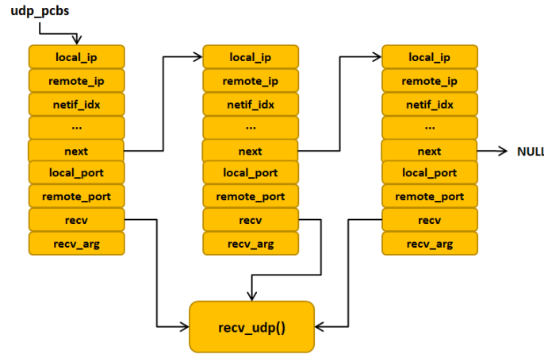
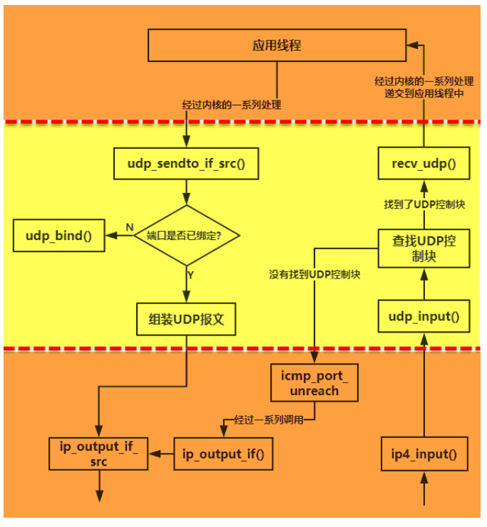

# 数据结构

## udp_hdr

LwIP 定义了一个 UDP 报文首部数据结构`udp_hdr`，定义了 UDP 报文首部的各个字段

```c
struct udp_hdr
{
    PACK_STRUCT_FIELD(u16_t src);
    PACK_STRUCT_FIELD(u16_t dest); /*src/dest UDP ports */
    PACK_STRUCT_FIELD(u16_t len);
    PACK_STRUCT_FIELD(u16_t chksum);
} PACK_STRUCT_STRUCT;
```

## udp pcb

与 TCP 协议一样，为了更好管理 UDP 报文， LwIP 定义了一个 UDP 控制块，记录与 UDP 通信的所有信息.

### udp pcb 链表

与 TCP 协议一样， LLwIP 中定义了一个名字为 `udp_pcbs` 的 UDP 控制块链表，记录主机中所有的 UDP 控制块，在处理的时候遍历列表，然后对控制块进行操作

```c
 struct udp_pcb *udp_pcbs;
```



### recv cb 函数

一般来说，我们使用 NETCONN API 或者是 Socket API 编程，是不需要我们自己去注册回调函数，因为 LwIP 内核会自动给我们注册回调`recv_udp`.
在 LwIP 接收到一个给本地的数据时候，就会调用这个回调函数.

# udp 数据收发



## 发送报文流程

从上层应用线程中得到数据，我们使用 NETCONN API 或者是 Socket API 编程，那么传输的数据经过内核的层层处理，最后调用 `udp_sendto_if_src` 函数进行发送 UDP 报文:

```c
udp_sendto_if_src:
    if (pcb->local_port == 0)
        //如果尚未绑定到端口, 先绑定
        err = udp_bind(pcb, &pcb->local_ip, pcb->local_port);
    //如果数据包太大无法添加udp header, 则返回错误
    //添加udp header
    if (pbuf_add_header(p, UDP_HLEN))
        //如果原有pbuf没有空间添加udp header, 则申请新的pbuf
        q = pbuf_alloc(PBUF_IP, UDP_HLEN, PBUF_RAM);
        pbuf_chain(q, p);//与原有obuf链接在一起
    //填充udp header
    //发送到ip层
    err = ip_output_if_src(q, src_ip, dst_ip, ttl, pcb->tos, ip_proto, netif);
```

## 接收报文流程

ip 层会调用`udp_input`处理收到的 udp 报文. UDP 协议会对报文进行一些合法性的检测，如果确认了这个报文是合法的，那么就遍历 UDP 控制块链表，在这些控制块中找到对应的端口，然后递交到应用层.

```c
udp_input:
    //检查最小长度, 不能小于udp header
    udphdr = (struct udp_hdr *)p->payload;
    //遍历 UDP 链表，找到对应的端口号，如果找不到，那就用链表的第一个未使用的 UDP 控制块
    for (pcb = udp_pcbs; pcb != NULL; pcb = pcb->next)
        //比较ip地址和端口
    if (pcb == NULL)
        pcb = uncon_pcb;//未找到, 使用第一个未使用的pcb

    if (for_us)
        pbuf_remove_header(p, UDP_HLEN);//去除udp header
        if (pcb != NULL)
            if (pcb->recv != NULL)
                pcb->recv(pcb->recv_arg, pcb, p, ip_current_src_addr(), src);//调用上层回调函数
        else
            //没有找到pcb, 回复目标不可达的ICMP报文
            pbuf_header_force(p, (s16_t)(ip_current_header_tot_len() + UDP_HLEN));//将指针移回ip header
            icmp_port_unreach(ip_current_is_v6(), p);
```
