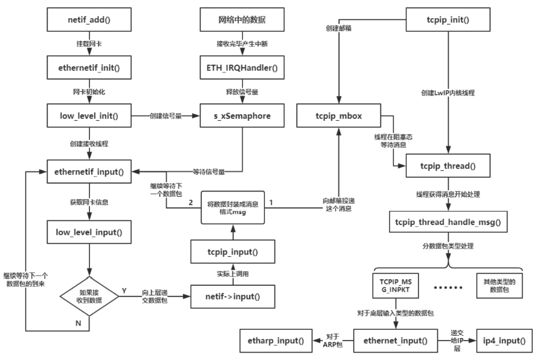
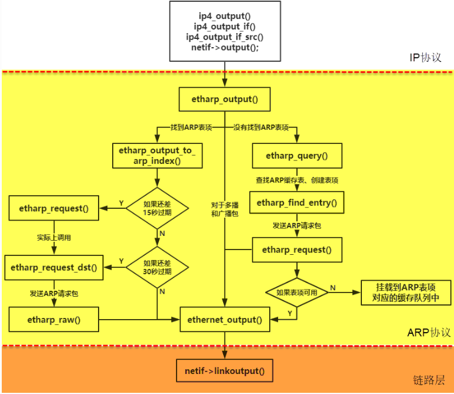

在 wlan sta connect 和 soatap start 的流程里，都有一步操作是把 netif 通过函数**net_wlan_add_netif**加入到 netif_list 中.这是 LwIP 的范畴, 加入到 netif_list 之后, LwIP 就可以管理这个网卡.
上层应用要收发数据就要使用 liblwip.a 提供的 API 处理数据, 而前提是必须使用 beken API 先连接到网络, lwip 可以正常的管理网卡.

# struct netif

LwIP 使用一个数据结构`struct netif`来描述一个网卡，但是由于网卡是直接与硬件打交道的，硬件不同则处理基本是不同的，所以必须由用户提供最底层接口函数，LwIP 提供统一的接口，但是底层的实现需要用户自己去完成，比如网卡的初始化，网卡的收发数据. 这样才能把数据从硬件接口到软件内核无缝连接起来.

- 当 LwIP 底层得到了网络的数据之后， 才会传入内核中去处理
- 同理，LwIP 内核需要发送一个数据包的时候，也需要调用网卡的发送函数

# ethernetif.c 文件

LwIP 中的 **ethernetif.c 文件**即为底层接口的驱动的模版，用户为自己的网络设备实现驱动时应参照此模块做修改。ethernetif.c 文件中的函数通常为与硬件打交道的底层函数，当有数据需要通过网卡接收或者发送数据的时候就会被调用，经过 LwIP 协议栈内部进行处理后，从应用层就能得到数据或者可以发送数据.

主要函数和功能如下:

- low_level_init: 网卡初始化函数，它主要完成网卡的复位及参数初始化，根据实际的网卡属性进行配置 netif 中与网卡相关的字段，例如网卡的 MAC 地址、长度，最大发送单元等
- low_level_output: 网卡的发送函数，它主要将内核的数据包发送出去，数据包采用 pbuf 数据结构进行描述
- low_level_input: 网卡的数据接收函数，该函数会接收一个数据包，为了内核易于对数据包的管理，该函数必须将接收的数据封装成 pbuf 的形式
- ethernetif_init: 上层管理网卡 netif 的到时候会被调用的函数，如使用 netif_add()添加网卡的时候，就会调用 ethernetif_init()函数对网卡进行初始化，其实该函数的最终调用的初始化函数就是 low_level_init 函数
- ethernetif_input: 调用 low_level_input 函数从网卡中读取一个数据包，然后解析该数据包的类型是属于 ARP 数据包还是 IP 数据包，再将包递交给上层

# 数据接收流程

板卡上 eth 接收完数据后产生一个中断，然后释放一个信号量通知网卡接收线程去处理这些接收的数据，然后将数据这些数据封装成消息，投递到 tcpip_mbox 邮箱中.
LwIP 内核线程得到这个消息，就对消息进行解析，根据消息中数据包类型进行处理，实际上是调用 **ethernet_input 函数**决定是否递交到 IP 层，如果是 ARP 包，内核就不会递交给 IP 层， 而是更新 ARP 缓存表，对于 IP 数据包则递交给 IP 层去处理.

# 数据包发送流程

如果是 ARP 数据包就会给 ARP 去处理，如果是 IP 数据报就使用 ip4_input()函数传递到上层，如果上层协议想要发送数据，也需要经过 ARP 协议将 IP 地址映射为 MAC 地址才能完成发送操作，IP 数据报通过 ip4_output 函数将上层数据包传递到 ARP 协议处理.
ARP 通过 **etharp_output 函数**接收到 IP 数据报后，就会进行发送，ARP 会先从数据包中进行分析，看看这个 IP 数据报是单播数据包还是多播或者是广播数据包，然后进行不同的处理：

- 对于多播或者是广播数据包，直接将数据包丢给网卡就行了（调用**ethernet_output 函数**）。
- 对于单播包，ARP 协议需要根据 IP 地址找到对应的 MAC 地址，然后才能正确发送.
  - 如果找不到 MAC 地址的话，还要延迟发送数据包，ARP 协议首先会创建一个 ARP 表项， 然后将数据包挂到 ARP 表项对应的缓存队列上，与此同时会发出一个 ARP 请求包，等待目标主机的回应后再发送 IP 数据报。

