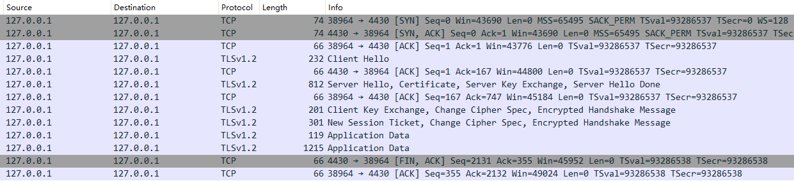
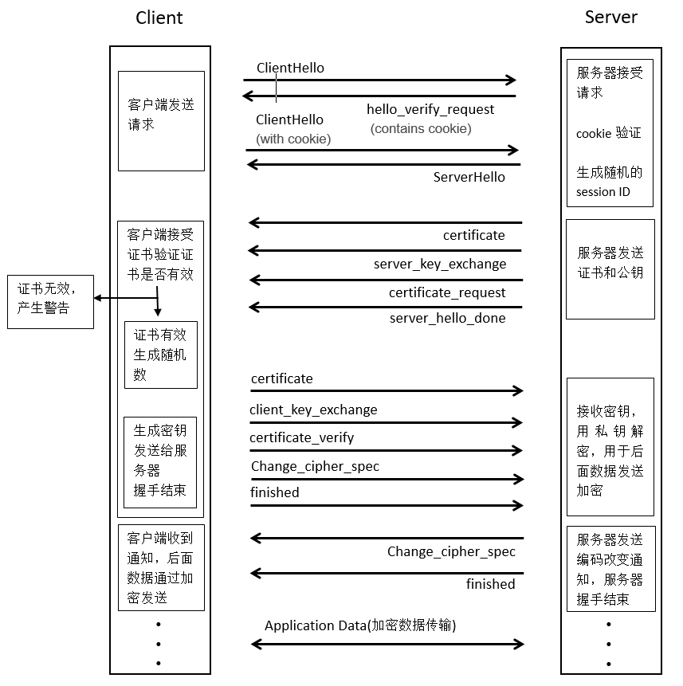
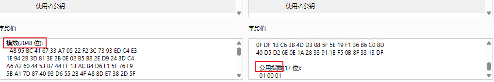
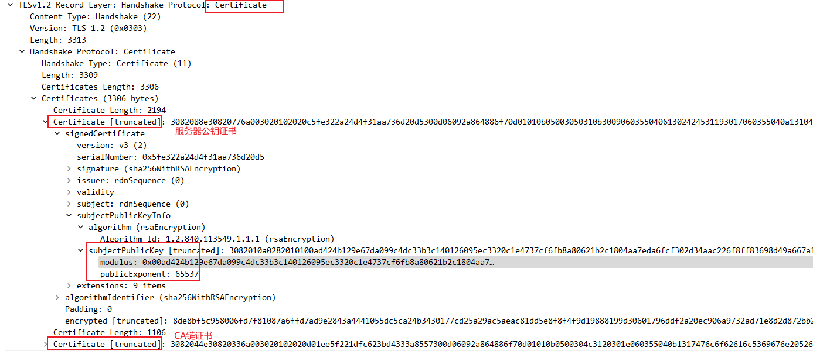

# 握手流程

> 在 mbedtls 代码中客户端和服务器端流程对应的处理函数入口分别为`mbedtls_ssl_handshake_client_step`和`mbedtls_ssl_handshake_server_step`

## SSL/TLS 握手流程


对应 [wireshark 抓包](handshake.assets/ssl_handshake.pcapng)如下：


- Client Hello：客户端向服务端打招呼；携带支持的协议、支持的安全套件供服务端选择；
- Server Hello：服务端回应客户客户端的招呼信息；结合客户端的信息，选择合适的加密套件；
- Certificate：服务端向客户端发送自己的数字证书（此证书包含服务端的公钥），以实现验证身份；
- Server Key Exchange：服务端向客户端发送基于选择的加密套件生成的公钥（此公钥为椭圆曲线的公钥，用于协商出对称加密的密钥）；
- Server Hello Done：服务端向客户端表示响应结束；
- Client Key Exchange：客户端向服务端发送自己生成的公钥（此公钥为椭圆曲线的公钥，用于协商出对称加密的密钥）；
- Change Cipher Spec：变更密码规范；告知服务端/客户端，以后的通信都是基于 AES 加密的；
- Encrypted Handshake Message：基于协商生成的密钥，用 AES 加密验证信息让服务端/客户端进行认证；如果对方可以解密，则双方认证无误开始通信；
- New Session Ticket：是优化 SSL 连接的一种方法

## DTLS 握手流程

DTLS 是基于 UDP 场景下数据包可能丢失或重新排序的情况下，为 UDP 定制和改进的 TLS 协议。


# Q&A

## 客户端是否需要校验服务器发来的公钥证书

修改如下配置:

```c
mbedtls_ssl_conf_authmode(&conf, MBEDTLS_SSL_VERIFY_NONE);
```

## MBEDTLS_MPI_MAX_SIZE 与 key size 关系

比如 RSA 公钥(其他类型同理), `pk_get_rsapubkey`中会检查收到服务器侧的公钥的长度, 大小不满足会返回**-0x3b00**错误.

```c
//MPI最大bits, 即公钥的最大长度
#define MBEDTLS_MPI_MAX_BITS ( 8 * MBEDTLS_MPI_MAX_SIZE )

pk_get_rsapubkey:
    if( ( ret = mbedtls_rsa_check_pubkey( rsa ) ) != 0 )
        return( MBEDTLS_ERR_PK_INVALID_PUBKEY ); //返回-0x3b00

    rsa->len = mbedtls_mpi_size( &rsa->N );
    return( 0 );//正常返回0表示成功

mbedtls_rsa_check_pubkey:
    if( mbedtls_mpi_bitlen( &ctx->N ) < 128 || mbedtls_mpi_bitlen( &ctx->N ) > MBEDTLS_MPI_MAX_BITS )
        //如果rsa key长度过小或过大, 返回错误
        return( MBEDTLS_ERR_RSA_KEY_CHECK_FAILED );
```

## 获取 RSA 公钥

RSA 公钥主要有两个信息:模数(modulus)和指数(exponent)，也就是我们所说的 N 和 E.

### 浏览器查看

使用浏览器可以直接查看到公钥证书中 N 和 E:


### openssl 解析证书

可以通过浏览器导出证书后, 使用 openssl 计算得出:

```bash
# 解析pubkey
openssl rsa -pubin -in pubkey.txt -text -noout
# 解析公钥证书
openssl x509 -text -noout -in server.crt
```

### whareshark 包中获取


