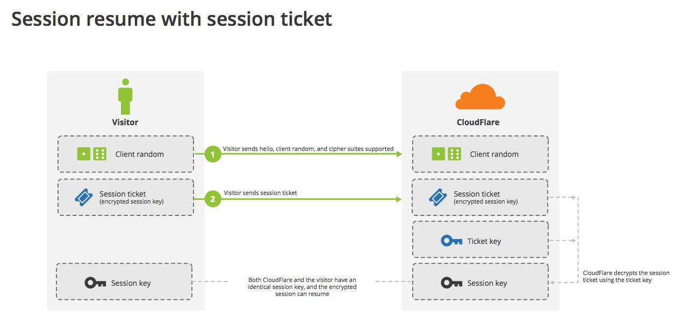

# 握手流程

> 在 mbedtls 代码中客户端和服务器端流程对应的处理函数入口分别为`mbedtls_ssl_handshake_client_step`和`mbedtls_ssl_handshake_server_step`

## SSL/TLS 握手流程

### 握手消息


对应 [wireshark 抓包](handshake.assets/ssl_handshake.pcapng)如下：


- Client Hello：客户端向服务端打招呼；携带支持的协议、支持的安全套件供服务端选择；
- Server Hello：服务端回应客户客户端的招呼信息；结合客户端的信息，选择合适的加密套件；
- Certificate：服务端向客户端发送自己的数字证书（此证书包含服务端的公钥），以实现验证身份；
- Server Key Exchange：服务端向客户端发送基于选择的加密套件生成的公钥（此公钥为椭圆曲线的公钥，用于协商出对称加密的密钥）；
  - **若使用 ECDH，客户端使用证书中的服务器公钥，服务端不发送 Server Key Exchange**
  - **若使用 ECDHE，服务器将通过 Server Key Exchange 消息告之客户端临时 ECDH 公钥，并使用服务器私钥对该临时公钥进行签名**
- Server Hello Done：服务端向客户端表示响应结束；
- Client Key Exchange：客户端向服务端发送自己生成的公钥（此公钥为椭圆曲线的公钥，用于协商出对称加密的密钥）；
- Change Cipher Spec：变更密码规范；告知服务端/客户端，以后的通信都是基于 AES 加密的；
- Encrypted Handshake Message：基于协商生成的密钥，用 AES 加密验证信息让服务端/客户端进行认证；如果对方可以解密，则双方认证无误开始通信；
- New Session Ticket：是优化 SSL 连接的一种方法

### 内部计算原理


## DTLS 握手流程

DTLS 是基于 UDP 场景下数据包可能丢失或重新排序的情况下，为 UDP 定制和改进的 TLS 协议。


## extension 扩展

### 扩展作用

Client 在 ClientHello 中申明多个自己可以支持的 Extension，以向 Server 表示自己有以下这些能力，或者向 Server 协商某些协议。
Server 收到 ClientHello 以后，依次解析 Extension，有些如果需要立即回应，就在 ServerHello 中作出回应，有些不需要回应，或者 Server 不支持的 Extension 就不用响应，忽略不处理。

在 TLS 握手时会有如下行为：

- Extension 不影响 TLS 握手的成功与否。Server 对 ClientHello 中的 Extension 有些不支持，忽略不处理即可，不影响握手的流程
- ServerHello 中回应 Client 的 Extension 一定要是 ClientHello 中的 Extension 的子集(小于等于)。ServerHello 中禁止出现 ClientHello 中没有出现的 Extension。如果一个 Client 在 ServerHello 中收到一个扩展类型但在相关的 ClientHello 中并没有请求，它必须用一个 unsupported_extension 致命 alert 消息来丢弃握手。
- 当 ClientHello 或 ServerHello 中有多个不同类型的扩展存在时，这些扩展可能会以任意顺序出现。一个类型不能拥有超过一个扩展

### TLS 1.2 的扩展

TLS 1.2 的扩展定义在**RFC6066**中，主要有：


### TLS 1.3 的扩展

TLS 1.3 的扩展定义在**RFC8446**中，主要有：


# session 恢复

有两种方法可以恢复原来的 session，不需要重新握:

- session ID: 每一次对话都有一个编号**session ID**。如果对话中断，下次重连的时候，只要客户端给出这个编号，且服务器有这个编号的记录，双方就可以重新使用已有的"对话密钥"，而不必重新生成一把
  
- session ticket: 客户端不再发送 session ID，而是发送一个**服务器在上一次对话中发送过来的 session ticket**。这个 session ticket 是加密的，只有服务器才能解密，其中包括本次对话的主要信息，比如对话密钥和加密方法。当服务器收到 session ticket 以后，解密后就不必重新生成对话密钥了
  

# 常见问题

## 客户端是否需要校验服务器发来的公钥证书

修改如下配置:

```c
mbedtls_ssl_conf_authmode(&conf, MBEDTLS_SSL_VERIFY_NONE);
```

## MBEDTLS_SSL_MAX_CONTENT_LEN

mbedtls 中需要设置`MBEDTLS_SSL_MAX_CONTENT_LEN`定义本地收发缓冲区(`mbedtls_ssl_setup`申请 2 个)大小, 在 nginx 中用`ssl_buffer_size`定义大小.

实际上可以理解为分包(TLS Record)大小。**客户端必须收到一个完整的 Record 才能解密**，Record 传输过程中又可能被分为多个 tcp 包。

- 如果缓冲很大，万一中间丢包，则不得不重传，直到组成完整的 Record。
- 如果比较小，则可以更及时地解密数据，相应地，分包个数也会增加，那么就不得不传输很多无意义的包头之类的数据。

**默认大小是 16k**，一般不用改。如果确认自己发送的数据都很小，比如一个 API 服务器，可以改得小一点，比如 4k

## MBEDTLS_MPI_MAX_SIZE 与 key size 关系

比如 RSA 公钥(其他类型同理), `pk_get_rsapubkey`中会检查收到服务器侧的公钥的长度, 大小不满足会返回**-0x3b00**错误.

```c
//MPI最大bits, 即公钥的最大长度
#define MBEDTLS_MPI_MAX_BITS ( 8 * MBEDTLS_MPI_MAX_SIZE )

pk_get_rsapubkey:
    if( ( ret = mbedtls_rsa_check_pubkey( rsa ) ) != 0 )
        return( MBEDTLS_ERR_PK_INVALID_PUBKEY ); //返回-0x3b00

    rsa->len = mbedtls_mpi_size( &rsa->N );
    return( 0 );//正常返回0表示成功

mbedtls_rsa_check_pubkey:
    if( mbedtls_mpi_bitlen( &ctx->N ) < 128 || mbedtls_mpi_bitlen( &ctx->N ) > MBEDTLS_MPI_MAX_BITS )
        //如果rsa key长度过小或过大, 返回错误
        return( MBEDTLS_ERR_RSA_KEY_CHECK_FAILED );
```

## 获取 RSA 公钥

RSA 公钥主要有两个信息:模数(modulus)和指数(exponent)，也就是我们所说的 N 和 E.

### 浏览器查看

使用浏览器可以直接查看到公钥证书中 N 和 E:


### openssl 解析证书

可以通过浏览器导出证书后, 使用 openssl 计算得出:

```bash
# 解析pubkey
openssl rsa -pubin -in pubkey.txt -text -noout
# 解析公钥证书
openssl x509 -text -noout -in server.crt
```

### wireshark 包中获取


#### 导出证书

那如何导出证书呢？
选择证书的节点，导出为**cer**格式的字节流:


#### 验证证书链

需要将 wireshakr 导出的证书转换为 PEM 格式(base64 编码), 之后用 CA 证书进行验证:

```bash
# 转换格式
openssl.exe x509 -inform DER -outform PEM -in server.cer -out server.pem
openssl.exe x509 -inform DER -outform PEM -in ca.cer -out ca.pem

# 验证证书链
openssl verify -CAfile ca.pem -verbose -purpose sslclient -issuer_checks server.pem

# 如果有多级证书链, 需要将root和中间ca导出到一个文件中, 再验证
cat root.pem ca.pem > bundle.pem
openssl verify -CAfile bundle.pem -verbose -purpose sslclient -issuer_checks server.pem
```

## cipher suite 怎么确定

mbedtls 中默认可支持的套件定义在`ciphersuite_definitions`, 由各个宏控制, 用`MBEDTLS_SSL_PRESET_DEFAULT`表示.
在函数`set_client_config`设置 ssl client 的加密套件时, 可以指定不同套件集:

```c
set_client_config:
    mbedtls_ssl_config_defaults(&tls->conf, MBEDTLS_SSL_IS_CLIENT, MBEDTLS_SSL_TRANSPORT_STREAM,
            MBEDTLS_SSL_PRESET_DEFAULT));//这里指定使用默认的套件集
```

## 0x7180 错误

在 TLS 中，错误码-0x7180 表示验证消息 MAC 失败。在 TLS 中使用 MAC (Message Authentication Code) 来验证传输的数据完整性和真实性。客户端和服务器共享一个密钥，通过计算 MAC 验证数据的真实性。

当返回错误-0x7180 时，表示 TLS 无法验证消息 MAC，也就是说，TLS 认为消息的密钥不匹配、消息被篡改、消息在传输过程中被重放等原因导致**计算得到的 MAC 和接收到的 MAC 不匹配**。这种情况可能是由于网络问题、安全配置问题或应用程序代码问题等原因引起的。
