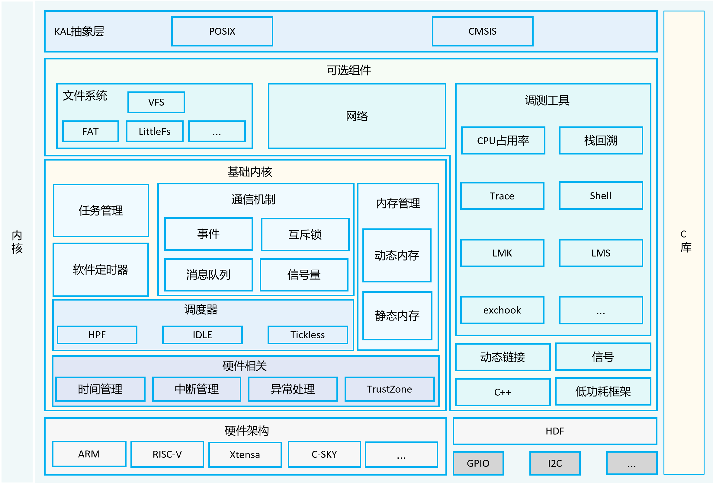

# 简介

OpenHarmony LiteOS-M 内核是面向 IoT 领域构建的轻量级物联网操作系统内核，具有小体积、低功耗、高性能的特点，其代码结构简单，主要包括内核最小功能集、内核抽象层、可选组件以及工程目录等，分为硬件相关层以及硬件无关层，硬件相关层提供统一的 HAL（Hardware Abstraction Layer）接口，提升硬件易适配性，不同编译工具链和芯片架构的组合分类，满足 AIoT 类型丰富的硬件和编译工具链的拓展。

其架构图如下:


# 代码结构

```shell
/kernel/liteos_m
├── arch                 # 内核指令架构层目录
│   ├── arm              # arm 架构代码
│   │   ├── arm9         # arm9 架构代码
│   │   ├── cortex-m3    # cortex-m3架构代码
│   │   ├── cortex-m33   # cortex-m33架构代码
│   │   ├── cortex-m4    # cortex-m4架构代码
│   │   ├── cortex-m55   # cortex-m55架构代码
│   │   ├── cortex-m7    # cortex-m7架构代码
│   │   └── include      # arm架构公共头文件目录
│   ├── csky             # csky架构代码
│   │   └── v2           # csky v2架构代码
│   ├── include          # 架构层对外接口存放目录
│   ├── risc-v           # risc-v 架构
│   │   ├── nuclei       # 芯来科技risc-v架构代码
│   │   └── riscv32      # risc-v官方通用架构代码
│   └── xtensa           # xtensa 架构代码
│       └── lx6          # xtensa lx6架构代码
├── components           # 可选组件
│   ├── backtrace        # 栈回溯功能
│   ├── cppsupport       # C++支持
│   ├── cpup             # CPUP功能
│   ├── dynlink          # 动态加载与链接
│   ├── exchook          # 异常钩子
│   ├── fs               # 文件系统
│   ├── lmk              # Low memory killer 机制
│   ├── lms              # Lite memory sanitizer 机制
│   ├── net              # Network功能
│   ├── power            # 低功耗管理
│   ├── shell            # shell功能
│   └── trace            # trace 工具
├── drivers              # 驱动框架Kconfig
├── kal                  # 内核抽象层
│   ├── cmsis            # cmsis标准接口支持
│   └── posix            # posix标准接口支持
├── kernel               # 内核最小功能集支持
│   ├── include          # 对外接口存放目录
│   └── src              # 内核最小功能集源码
├── testsuites           # 内核测试用例
├── tools                # 内核工具
├── utils                # 通用公共目录
```
# 编译环境搭建
1. 通过repo下载openharmony源码
1. 安装编译器和二进制工具: `bash build/prebuilts_download.sh`
1. 安装hb构建工具: `python3 -m pip install --user build/hb`