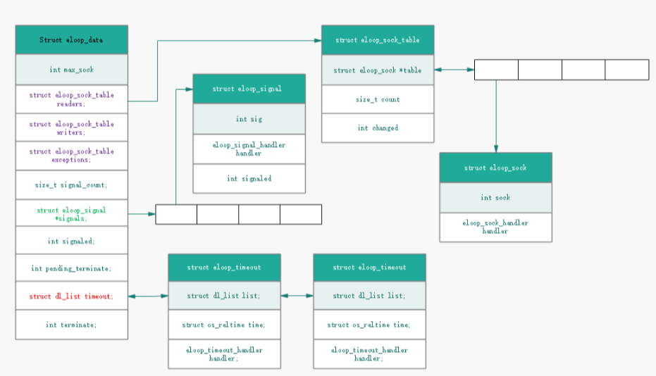

wpa_supplicant 的程序的生命就是在运行一个 EVENT LOOP, 等待各种 Event 的到来，然后做相应的处理. **wpa_supplicant 没有多线程, 所有事件都是一个进程完成的.**
要处理的 Event 有三大种类型:

- Socket 事件: 基于 epoll 或 select 监听多个 socket
  - read socket
  - write socket
  - exception socket
- Timeout 事件
- Signal 事件

# eloop_data 结构

`struct eloop_data`结构体是一个统领全局的数据结构，只有一个实例. 其基本结构如下:

- socket 事件分为三类, 每一类用`eloop_sock_table`中的数组指针保存多个 socket id.
- 每个 signal 用一个`eloop_signal`表示, 保存在`eloop_data`中的数组指针中
- 每个 timeout 用一个`eloop_timeout`表示(**每个 timer 按超时时间从小到大排序**), 保存在`eloop_data`中的链表中

eloop_register_signal
eloop_process_pending_signals

# eloop_run

该函数是 wpa_supplicant 里主循环, 其基本处理流程为:

1. 循环判断 eloop_data 全局变量中是否有需要监听的 socket, 是否有 timeout, 是否被用户主动终结(函数`eloop_terminate`). 进入循环条件满足, 执行第二步.
1. 找到 timeout 链表的第一项（因为是按超时先后排序的，所以第一项肯定是最先超时的），计算超时时间距现在还有多久，并据此设置 select/poll/epoll 的 timeout 参数。
1. 填充要监听的 socket ids
   1. select 方式: 设置 rfds，wfds 和 efds 三个 fd_set, 遍历各个 eloop_sock_table，把 socket id 加入相应的 fd_set 里面。
   1. poll 方式: 遍历各个 eloop_sock_table, 将 socket id 加入到 `eloop_data.pollfds`
   1. epoll 方式: 之前添加 socket 时已经注册了要监听的事件, 直接使用 `eloop.epollfd` 和 `eloop.epoll_events`
1. 调用 select/poll/epoll_wait, 可能阻塞在此处。
1. `eloop_process_pending_signals()`处理阻塞期间没来得及处理的 signal 事件
1. 判断是否有超时发生，如果是则调用其 handler，并从 timeout 链表移除
1. 检测是否有 socket 事件被监听到, 如有调用其 handler 方法
   1. select 方式: 遍历各个 eloop_sock_table，检测 socket id 是否在返回的 fd_set 中
   1. poll 方式: 遍历各个 eloop_sock_table, 检测 socket id 是否在返回的 e`loop_data.pollfds_map` 中
   1. epoll 方式: 检测返回的 `eloop.epoll_events`
1. 继续下次循环。

# 添加事件

- 添加 socket 事件: `eloop_register_sock`
- 添加 signal 事件: `eloop_register_signal`
  - **注意**: 在`eloop_register_signal`函数注册的 handler 并不是当 signal 发生时就会自动执行的。**当 Signal 发生时会调用`eloop_handle_signal`对该 `eloop_signal` 的 `signaled` 变量加 1，以表明 signal 已收到并处于 Pending 状态。在 `eloop_run` 中调用 `eloop_process_pending_signals` 才会对每个处于 Pending 状态的 signal 调用其 handler**。
- 添加 timeout 事件:
  - 添加 timeout: `eloop_register_timeout`
  - 缩短当前 timeout 的超时时间: `eloop_deplete_timeout`
  - 延长当前 timeout 的超时时间: `eloop_replenish_timeout`

# 删除事件

- 删除 socket 事件: `eloop_unregister_sock`
- 删除 signal 事件: 无法删除?
- 删除 timeout 事件: `eloop_remove_timeout` 或 `eloop_cancel_timeout`
